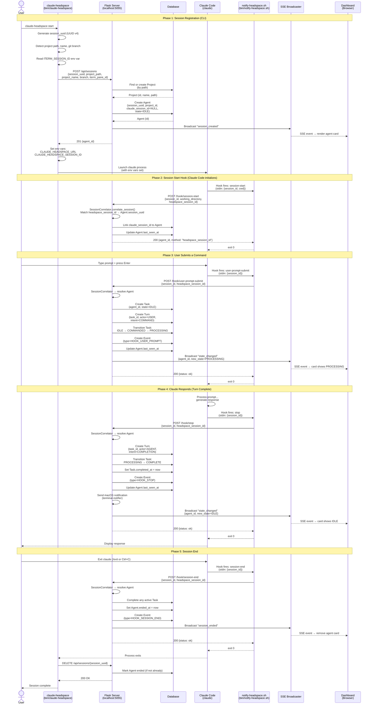
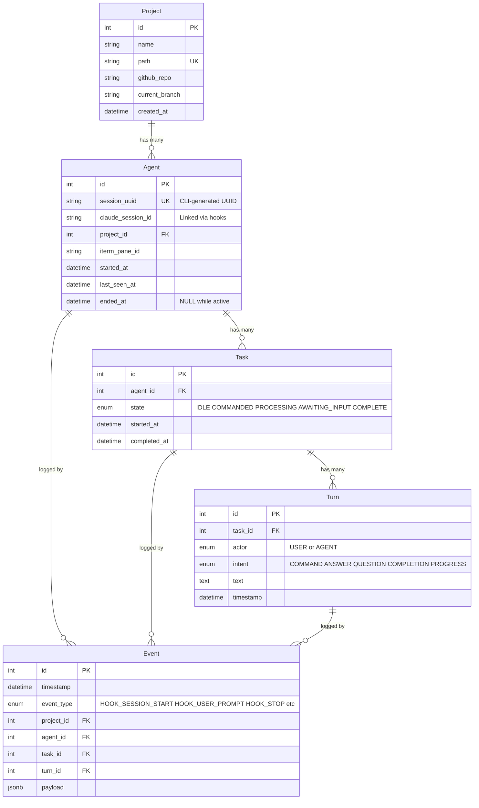
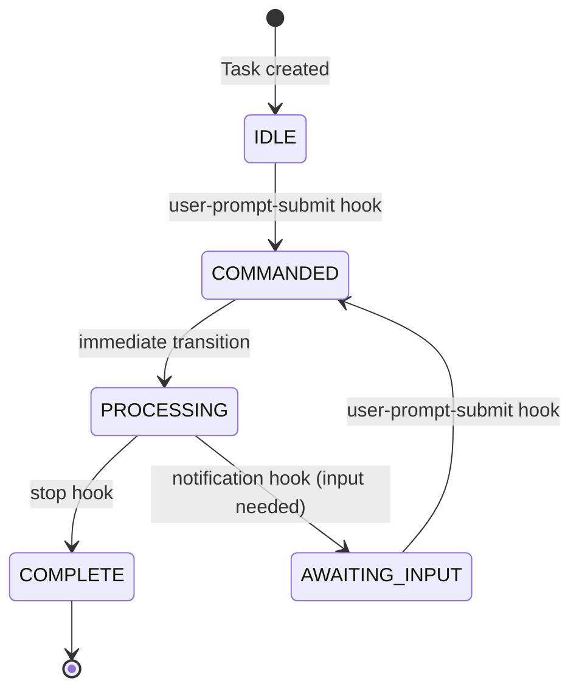
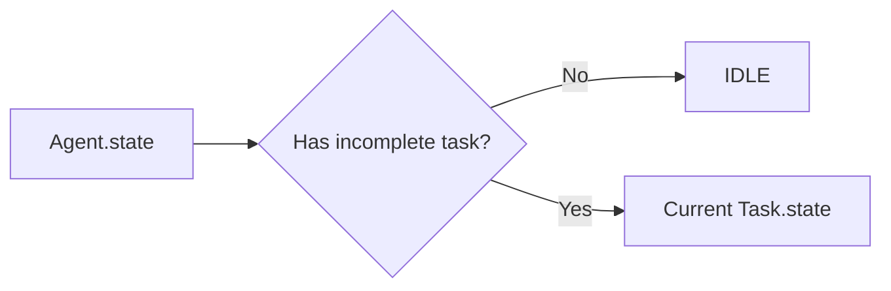

# Full Cycle Sequence Diagram

## Session Lifecycle: CLI Start → Task Complete → Session End

## Entity Relationship Summary

## Task State Machine

## Agent State Derivation

Agent does not store its own state. It is derived from the current task:

