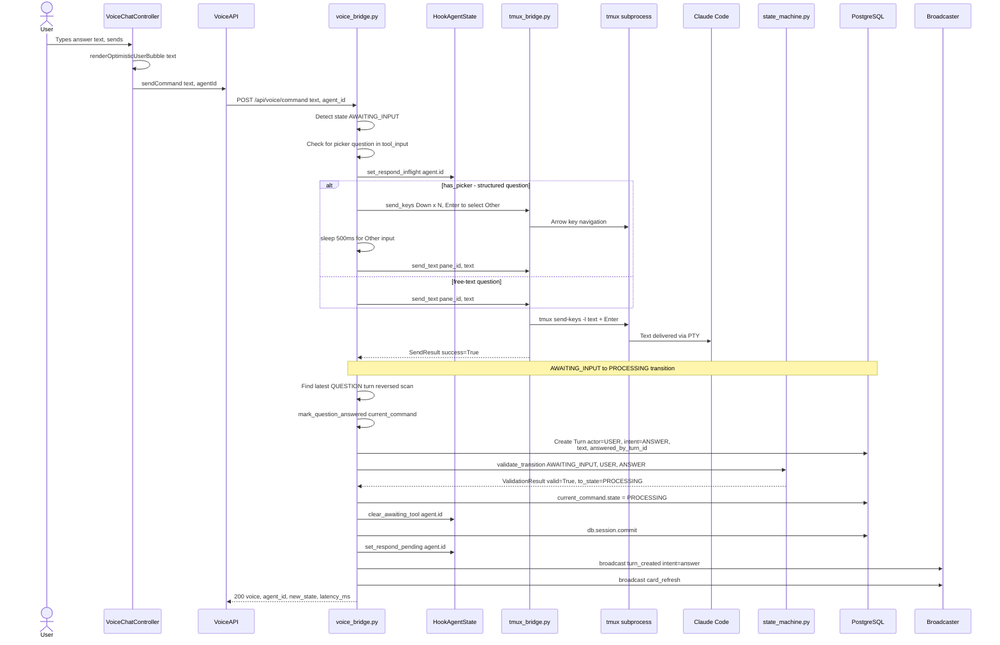
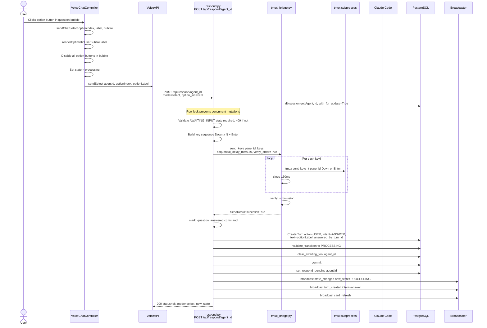
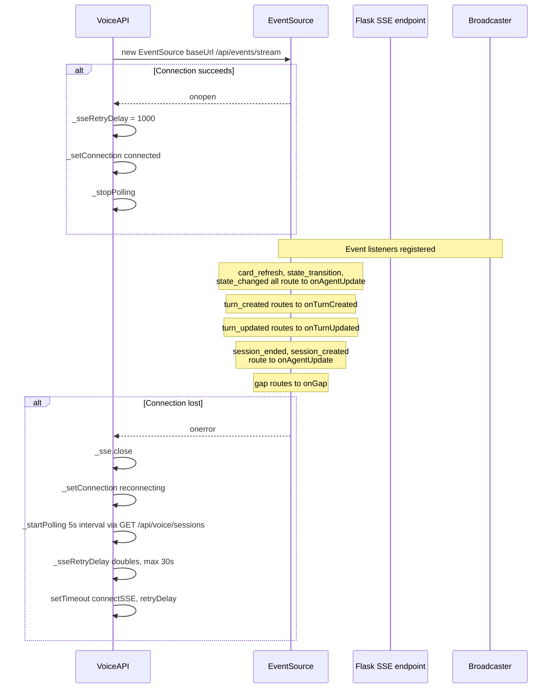
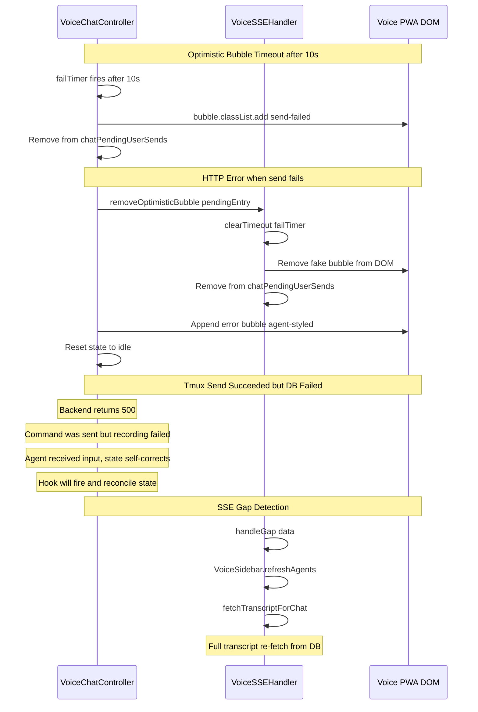

# Voice Bridge Message Flow — Sequence Diagram

## Primary Flow: Text Command (IDLE/PROCESSING Agent)

```mermaid
sequenceDiagram
    actor User
    participant PWA as Voice PWA<br/>Browser
    participant Controller as VoiceChatController
    participant Renderer as VoiceChatRenderer
    participant API as VoiceAPI
    participant Flask as voice_bridge.py<br/>POST /api/voice/command
    participant HookState as HookAgentState
    participant TmuxBridge as tmux_bridge.py
    participant Tmux as tmux subprocess
    participant PTY as tmux PTY
    participant Claude as Claude Code<br/>Ink TUI
    participant Lifecycle as CommandLifecycleManager
    participant DB as PostgreSQL
    participant Broadcaster as Broadcaster<br/>SSE
    participant SSEHandler as VoiceSSEHandler

    Note over User,Claude: === PHASE 1: Optimistic UI ===

    User->>Controller: Types text, presses Enter/Send
    Controller->>Controller: sendChatCommand text
    Controller->>Controller: renderOptimisticUserBubble text
    Controller->>Controller: fakeTurnId = pending- + timestamp
    Controller->>Controller: Set 10s failTimer to mark send-failed
    Controller->>Controller: Push to chatPendingUserSends
    Controller->>Renderer: renderChatBubble fakeTurn, prevTurn
    Renderer-->>PWA: Bubble appears in DOM immediately
    Controller->>Controller: scrollChatToBottom
    Controller->>Controller: Clear textarea, reset height
    Controller->>Controller: VoiceState.chatAgentState = processing
    Controller->>Controller: updateTypingIndicator
    Controller->>Controller: updateChatStatePill

    Note over User,Claude: === PHASE 2: HTTP Request ===

    Controller->>API: sendCommand text, targetAgentId
    API->>API: Build headers Content-Type, Bearer token
    API->>API: Create AbortController 30s timeout
    API->>Flask: POST /api/voice/command<br/>body: text, agent_id

    Note over Flask,Claude: === PHASE 3: Backend Processing ===

    Flask->>Flask: voice_auth_check<br/>bypass for localhost/LAN
    Flask->>Flask: Parse JSON: text, agent_id, file_path
    Flask->>Flask: Validate: text or file_path required

    alt agent_id provided
        Flask->>DB: db.session.get Agent, agent_id
        DB-->>Flask: Agent record
    else auto-target enabled
        Flask->>DB: Query active agents in AWAITING_INPUT
        DB-->>Flask: Matching agents
        Note over Flask: 409 if zero or multiple agents match
    end

    Flask->>Flask: current_command = agent.get_current_command
    Flask->>Flask: Determine state: is_idle / is_processing / is_answering

    alt Agent is AWAITING_INPUT with picker question
        Flask->>Flask: Scan turns reversed for QUESTION with tool_input
        Flask->>Flask: Count options from first question
        Flask->>Flask: has_picker = True, picker_option_count = N
    end

    Flask->>Flask: Validate agent.tmux_pane_id exists, 503 if not
    Flask->>Flask: Read tmux_bridge config from config.yaml

    Note over Flask,Claude: === PHASE 4: Tmux Send ===

    Flask->>HookState: set_respond_inflight agent.id
    Note over HookState: Prevents duplicate turn creation<br/>if hook fires during send

    alt has_picker AND is_answering
        Note over Flask,Tmux: Navigate to Other option first

        Flask->>TmuxBridge: send_keys pane_id, Down x N + Enter,<br/>verify_enter=True
        TmuxBridge->>TmuxBridge: _get_send_lock pane_id
        TmuxBridge->>TmuxBridge: capture_pane for pre-keys baseline
        loop For each key: Down, Down, ..., Enter
            TmuxBridge->>Tmux: subprocess tmux send-keys -t pane_id Key
            Tmux->>PTY: Key event delivered via PTY
            TmuxBridge->>TmuxBridge: sleep sequential_delay_ms 150ms
        end
        TmuxBridge->>TmuxBridge: _verify_submission pre_content
        TmuxBridge->>TmuxBridge: capture_pane, compare with pre-content
        TmuxBridge-->>Flask: SendResult success=True

        Flask->>Flask: sleep select_other_delay_ms 500ms
        Note over Flask: Wait for Other text input to appear

        Flask->>TmuxBridge: send_text pane_id, text
    else Normal text send
        Flask->>TmuxBridge: send_text pane_id, text,<br/>verify_enter=not is_processing
    end

    Note over TmuxBridge,Claude: send_text internals

    TmuxBridge->>TmuxBridge: _get_send_lock pane_id
    TmuxBridge->>TmuxBridge: text.rstrip sanitise trailing whitespace

    opt detect_ghost_text is True
        TmuxBridge->>Tmux: capture-pane -t pane_id -p -S -3 -e
        Tmux-->>TmuxBridge: Pane content with ANSI escapes
        TmuxBridge->>TmuxBridge: _has_autocomplete_ghost content
        opt Ghost text detected via SGR 2 or 90
            TmuxBridge->>Tmux: tmux send-keys -t pane_id Escape
            Tmux->>PTY: Escape key dismisses autocomplete
            TmuxBridge->>TmuxBridge: sleep clear_delay_ms 200ms
        end
    end

    TmuxBridge->>Tmux: tmux send-keys -t pane_id -l user_text
    Note over Tmux,PTY: -l flag = literal mode<br/>no key name interpretation
    Tmux->>PTY: Characters written to PTY
    PTY->>Claude: Characters appear in Ink stdin

    TmuxBridge->>TmuxBridge: sleep text_enter_delay_ms 120ms

    opt verify_enter is True
        TmuxBridge->>Tmux: capture-pane -t pane_id -p -S -5
        Tmux-->>TmuxBridge: Pre-Enter pane baseline
    end

    TmuxBridge->>Tmux: tmux send-keys -t pane_id Enter
    Tmux->>PTY: Enter key event
    PTY->>Claude: Ink onSubmit handler triggered

    opt verify_enter is True
        TmuxBridge->>TmuxBridge: sleep enter_verify_delay_ms 200ms
        TmuxBridge->>Tmux: capture-pane -t pane_id -p -S -5
        Tmux-->>TmuxBridge: Post-Enter pane content
        TmuxBridge->>TmuxBridge: _pane_content_changed before, after

        alt Content unchanged - Enter lost
            opt Ghost text detected on retry
                TmuxBridge->>Tmux: tmux send-keys -t pane_id Escape
                TmuxBridge->>TmuxBridge: sleep clear_delay_ms 200ms
            end
            TmuxBridge->>Tmux: tmux send-keys -t pane_id Enter retry
            Note over TmuxBridge: max_enter_retries=1
        end
    end

    TmuxBridge-->>Flask: SendResult success, latency_ms

    Note over Flask,Broadcaster: === PHASE 5: Persistence & Broadcast ===

    alt SendResult.success is False
        Flask->>HookState: clear_respond_inflight agent.id
        Flask-->>API: 502 error send_failed
        API-->>Controller: Promise.reject err
        Controller->>SSEHandler: removeOptimisticBubble pendingEntry
        Controller->>Controller: Show error bubble
        Controller->>Controller: Reset state to idle
    else SendResult.success is True - IDLE/PROCESSING path
        Flask->>Lifecycle: process_turn agent, USER, text
        Lifecycle->>Lifecycle: Detect intent COMMAND
        Lifecycle->>DB: Create Turn actor=USER, intent=COMMAND
        Lifecycle->>DB: Create Command if none exists

        opt Command in COMMANDED state
            Flask->>Lifecycle: update_command_state COMMANDED to PROCESSING
        end

        Flask->>DB: agent.last_seen_at = now
        Flask->>DB: db.session.commit

        Flask->>Broadcaster: broadcast turn_created:<br/>agent_id, project_id, text,<br/>actor=user, intent=command,<br/>command_id, turn_id, timestamp

        Flask->>HookState: set_respond_pending agent.id
        Note over HookState: Hook user_prompt_submit will<br/>skip duplicate turn creation

        Flask->>Flask: broadcast_card_refresh agent, voice_command
        Flask->>Broadcaster: broadcast card_refresh

        opt Pending summarisations
            Flask->>Flask: summarisation_service.execute_pending
        end

        Flask-->>API: 200 voice, agent_id, new_state, latency_ms
    end

    Note over PWA,SSEHandler: === PHASE 6: SSE Delivery & Bubble Promotion ===

    Broadcaster-->>SSEHandler: SSE event turn_created
    SSEHandler->>SSEHandler: handleTurnCreated data
    SSEHandler->>SSEHandler: Check agent_id matches targetAgentId
    SSEHandler->>SSEHandler: Is actor user AND turn_id present?

    SSEHandler->>SSEHandler: Search chatPendingUserSends<br/>for matching pending entry
    SSEHandler->>SSEHandler: Find by fakeTurnId

    alt Pending bubble found
        SSEHandler->>PWA: fakeBubble.setAttribute data-turn-id to realId
        SSEHandler->>PWA: Set data-timestamp from server
        SSEHandler->>SSEHandler: clearTimeout pending.failTimer
        SSEHandler->>SSEHandler: Remove from chatPendingUserSends
        Note over SSEHandler,PWA: Bubble promoted from fake ID to real DB ID
    else No pending match
        SSEHandler->>SSEHandler: Check if turn_id already in DOM
        opt Not in DOM
            SSEHandler->>Renderer: createBubbleEl turn
            Renderer-->>PWA: New bubble appended to chat
        end
    end

    Broadcaster-->>SSEHandler: SSE event card_refresh
    SSEHandler->>SSEHandler: handleAgentUpdate data
    SSEHandler->>SSEHandler: Update VoiceState.chatAgentState
    SSEHandler->>Controller: updateTypingIndicator
    SSEHandler->>Controller: updateChatStatePill
    SSEHandler->>SSEHandler: VoiceSidebar.refreshAgents

    API-->>Controller: Promise.resolve
    Note over Controller: Success handler is empty<br/>SSE handles confirmation
```

## Alternate Flow: Answering a Question (AWAITING_INPUT Agent)

## Alternate Flow: Option Selection (via sendSelect)

## SSE Connection & Reconnection

## Error Handling & Recovery Flows

## Timing Summary

| Phase | Component | Duration |
|-------|-----------|----------|
| Optimistic render | Controller → DOM | ~1ms |
| HTTP request | Browser → Flask | Network RTT |
| Auth check | voice_auth_check | ~0ms (bypass for LAN) |
| Agent lookup | DB query | ~1-5ms |
| Ghost text detect | capture-pane + check | ~5-10ms |
| Ghost dismiss | Escape + delay | 200ms (if needed) |
| Text send | send-keys -l | ~5ms |
| Text→Enter delay | sleep | 120ms |
| Enter verification | capture + compare | ~200ms |
| Enter retry | Escape + re-enter | ~400ms (if needed) |
| Picker navigation | N×(Down + 150ms) | N×155ms |
| "Other" wait | sleep | 500ms |
| DB persist | Turn + Command create | ~5-10ms |
| DB commit | PostgreSQL | ~5-20ms |
| SSE broadcast | Broadcaster → EventSource | ~1-5ms |
| Bubble promotion | SSEHandler → DOM | ~1ms |
| **Total (happy path)** | **End-to-end** | **~350-500ms** |
| **Total (picker)** | **With "Other" nav** | **~900-1200ms** |
| Optimistic timeout | failTimer | 10,000ms |
| HTTP timeout | AbortController | 30,000ms |
| Subprocess timeout | tmux calls | 5,000ms |
