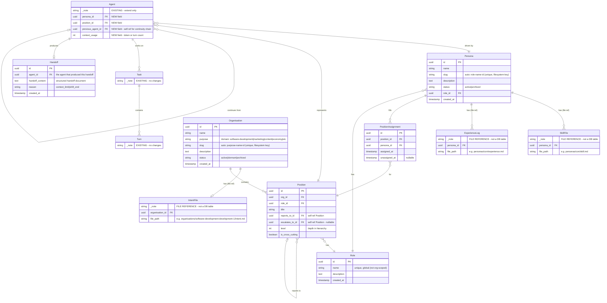

# Claude Headspace — Organisational Model ERD (Full)

**Date:** 16 February 2026 (updated 1 March 2026 — Organisation Workshop decisions)
**Status:** Data model design — new entities for multi-org persona management
**Note:** Agent, Task, and Turn are existing Headspace 3.1 entities shown here as references only. Do not recreate them. SkillFile and ExperienceLog are version-managed files in the repo, not database tables — they appear here as file references only.

---

## ERD

---

## New Database Tables

| Table | Purpose |
|-------|---------|
| **Persona** | Named identity in the persona registry. Exists independently of any organisation. |
| **Organisation** | A structured grouping of positions with a defined hierarchy and purpose. Has `purpose` (domain category) and auto-generated `slug` (`{purpose}-{name}-{id}`) for filesystem path key. Dev org, marketing org, etc. |
| **Role** | A global specialisation (architect, developer, pm, qa, ar-director, etc.). Shared across all organisations — not org-scoped. Referenced by both Persona and Position. |
| **Position** | A seat in the org chart. Has a role, reports to another position. Self-referential tree. |
| **PositionAssignment** | Join table: which persona fills which position. Lifecycle tracked via timestamps. Runtime availability derived from Agent state. |
| **Handoff** | Context limit handoff content. Belongs to the outgoing agent. The incoming agent finds it via the `previous_agent_id` chain. |

## Existing Tables (Extended)

| Table | Changes |
|-------|---------|
| **Agent** | Add `persona_id` (FK), `position_id` (FK), `previous_agent_id` (FK, self-ref, nullable), `context_usage` (int) |
| **Task** | No changes |
| **Turn** | No changes |

## File References (Not DB Tables)

| Reference | Purpose |
|-----------|---------|
| **SkillFile** | Version-managed markdown file. Core skills and preferences per persona. Path: `data/personas/{slug}/skill.md` |
| **ExperienceLog** | Version-managed markdown file. Append-only learnings, periodically curated. Path: `data/personas/{slug}/experience.md` |
| **IntentFile** | Version-managed markdown file. Organisation intent engineering — what to optimise for, protect, and never sacrifice. Path: `data/organisations/{slug}/intent.md`. Merged into YAML export by CLI. |

## Key Design Notes

- **Agent continuity is a self-referential chain.** `previous_agent_id` on Agent links consecutive sessions for the same body of work. First agent in a chain has `previous_agent_id = null`. Walk the chain to see full history. This replaces the need for from/to agent references on Handoff.
- **Handoff is a content container.** It belongs to the outgoing agent (the one that produced it). The incoming agent finds the handoff by looking up the Handoff record for its `previous_agent_id`. No structural linking needed — the Agent chain handles that.
- **Position hierarchy is self-referential.** `reports_to_id` and `escalates_to_id` both point back to Position. This builds the org chart as a tree. Escalation path can differ from reporting path (e.g. Verner reports to Gavin but escalates architectural issues to Robbo).
- **PositionAssignment has no status field.** Assignment lifecycle is tracked via `assigned_at` / `unassigned_at` timestamps. Runtime availability (is the persona busy?) is derived from whether an active Agent record exists with that persona_id.
- **Personas are org-independent.** A persona can hold positions in multiple organisations simultaneously via separate PositionAssignment records.
- **Handoff content is stored in DB**, not as an external file. It is structured data (status, what was done, what remains, blockers, next steps) persisted for the next agent session to consume.
- **The operator is not modelled as a Persona.** The top of every org hierarchy implicitly reports to the operator (Sam).

## Organisation Workshop Updates (1 March 2026)

The following changes were decided during the Organisation Workshop (Section 1):

- **Organisation.purpose added.** Domain/category field (software-development, marketing, content, economy, etc.). Required on create.
- **Organisation.slug added.** Auto-generated as `{purpose}-{name}-{id}`, same after-insert event mechanism as Persona. Unique. Serves as the filesystem path key for `data/organisations/{slug}/`.
- **Persona.slug added to ERD.** Already implemented but was missing from this document. Auto-generated as `{role}-{name}-{id}`. Filesystem path key for `data/personas/{slug}/`.
- **Persona.role_id added to ERD.** Direct FK from Persona to Role. Already implemented. ERD previously linked Persona to Role only through PositionAssignment → Position → Role.
- **Role is global, not org-scoped.** `org_id` FK removed from Role. `role_type` and `can_use_tools` deferred — no current use case. Roles are a shared vocabulary across all organisations.
- **Organisation → Role relationship removed.** Roles are no longer org-scoped. Positions reference roles directly.
- **IntentFile added as file reference.** Organisation-scoped intent engineering document at `data/organisations/{slug}/intent.md`. Merged into YAML export by CLI.
- **PositionAssignment confirmed as required.** Must be built (exists in ERD, not yet implemented). Required for persona-to-position binding with lifecycle tracking (assigned_at/unassigned_at).
- **Agent.position_id ondelete must change.** CASCADE → SET NULL. Confirmed for Phase 2 migration.
