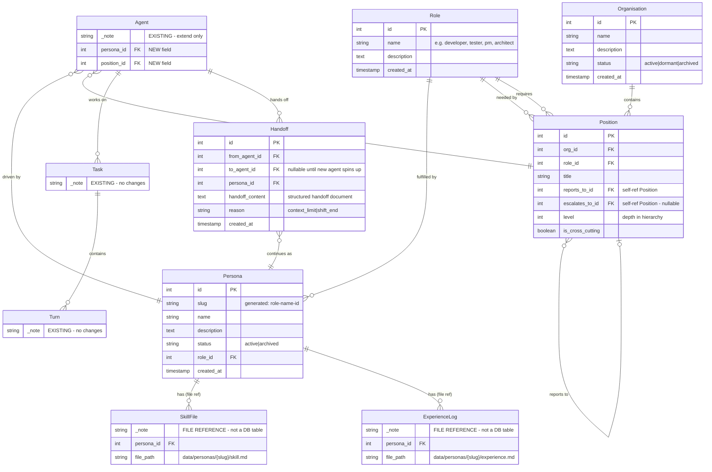

# Claude Headspace — Organisational Model ERD (Full)

**Date:** 17 February 2026
**Status:** Data model design — new entities for multi-org persona management
**Revised:** Workshop review session — resolved integer PKs, shared Role lookup, dropped PositionAssignment/can_use_tools/availability constraint
**Note:** Agent, Command, and Turn are existing Headspace 3.1 entities shown here as references only. Do not recreate them. SkillFile and ExperienceLog are version-managed files in the `data/` directory, not database tables — they appear here as file references only.

---

## ERD

---

## New Database Tables

| Table | Purpose |
|-------|---------|
| **Role** | Shared lookup table — system-wide vocabulary of work types (developer, tester, pm, architect, qa, ops). Referenced by both Persona and Position. |
| **Persona** | Named identity in the persona registry. Has a role (what they are) and a slug for filesystem path. Exists independently of any organisation. |
| **Organisation** | A structured grouping of positions with a defined hierarchy. Dev org, marketing org, etc. |
| **Position** | A seat in the org chart. Has a role (what it needs), reports to another position. Self-referential tree. |
| **Handoff** | Context limit handoff record. Stores the structured handoff document as DB content. |

## Existing Tables (Extended)

| Table | Changes |
|-------|---------|
| **Agent** | Add `persona_id` (FK to Persona), `position_id` (FK to Position) |
| **Task** | No changes |
| **Turn** | No changes |

## File References (Not DB Tables)

| Reference | Purpose |
|-----------|---------|
| **SkillFile** | Version-managed markdown file. Core skills and preferences per persona. Path: `data/personas/{slug}/skill.md` |
| **ExperienceLog** | Version-managed markdown file. Append-only learnings, periodically curated. Path: `data/personas/{slug}/experience.md` |

## Key Design Notes

- **Role is a shared lookup.** Both Persona ("I am a developer") and Position ("this seat needs a developer") reference the same Role table. To find personas that can fill a position, match on role_id.
- **Integer PKs throughout.** Matches the existing codebase convention (Agent, Command, Turn all use int PKs).
- **Slug belongs to Persona.** Generated as `{role_name}-{persona_name}-{id}` from the persona's role and name. No multi-joins needed — Persona has role_id FK so deriving the slug is a single join.
- **No PositionAssignment table.** The persona-to-position relationship is established through Agent (which has both persona_id and position_id). Assignment status is derived from agent status.
- **No availability constraint.** Multiple agents can share the same persona simultaneously. Duplicating a persona (spinning up multiple Cons) is advantageous, not a constraint to enforce.
- **Position hierarchy is self-referential.** `reports_to_id` and `escalates_to_id` both point back to Position. Escalation path can differ from reporting path.
- **Personas are org-independent.** A persona can represent positions in multiple organisations via separate Agent sessions.
- **Handoff content is stored in DB**, not as an external file. Structured data persisted for the next agent session to consume.
- **The operator is not modelled as a Persona.** The top of every org hierarchy implicitly reports to the operator (Sam).
