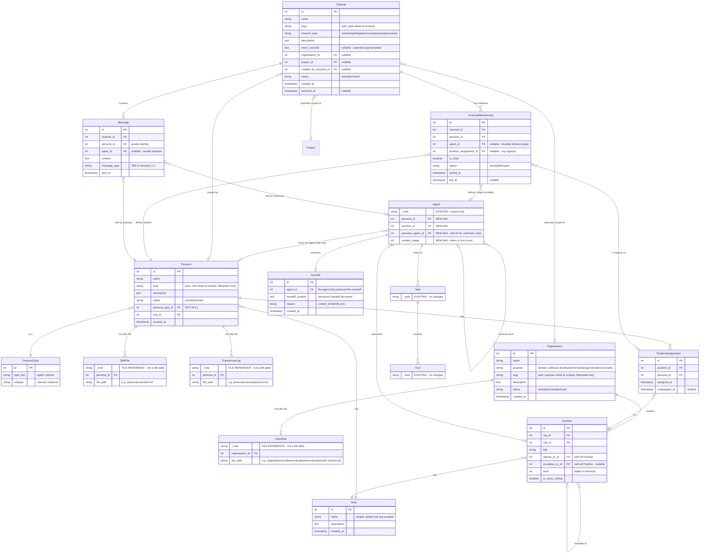

# Claude Headspace — Organisational Model ERD (Full)

**Date:** 16 February 2026 (updated 2 March 2026 — Epic 9 Workshop Decision 1.1)
**Status:** Data model design — organisational model + channel communication layer
**Note:** Agent, Task, and Turn are existing Headspace 3.1 entities shown here as references only. Do not recreate them. SkillFile and ExperienceLog are version-managed files in the repo, not database tables — they appear here as file references only.

---

## ERD

---

## New Database Tables

### Organisational Layer (Epic 8)

| Table | Purpose |
|-------|---------|
| **Persona** | Named identity in the persona registry. Exists independently of any organisation. Gains `persona_type_id` FK to PersonaType. |
| **Organisation** | A structured grouping of positions with a defined hierarchy and purpose. Has `purpose` (domain category) and auto-generated `slug` (`{purpose}-{name}-{id}`) for filesystem path key. Dev org, marketing org, etc. |
| **Role** | A global specialisation (architect, developer, pm, qa, ar-director, etc.). Shared across all organisations — not org-scoped. Referenced by both Persona and Position. |
| **Position** | A seat in the org chart. Has a role, reports to another position. Self-referential tree. |
| **PositionAssignment** | Join table: which persona fills which position. Lifecycle tracked via timestamps. Runtime availability derived from Agent state. |
| **Handoff** | Context limit handoff content. Belongs to the outgoing agent. The incoming agent finds it via the `previous_agent_id` chain. |

### Communication Layer (Epic 9 — Decision 1.1)

| Table | Purpose |
|-------|---------|
| **PersonaType** | Lookup table classifying personas into quadrants: `type_key` (agent/person) × `subtype` (internal/external). 4 rows, both fields NOT NULL. Determines delivery mechanism, trust boundaries, and visibility scope at the service layer. |
| **Channel** | Named conversation container at system level. Cross-project by default, optionally scoped to Organisation and/or Project. Has `channel_type` enum (workshop/delegation/review/standup/broadcast) mapping to Paula's intent templates. |
| **ChannelMembership** | Persona-based channel participation. Links persona (stable identity), agent (mutable delivery target), and position assignment (organisational capacity). Chair designation via `is_chair` boolean. |
| **Message** | Atomic unit of channel communication. Attributed to persona (identity) with agent instance traceability. Full column design in Decision 1.2. |

## Existing Tables (Extended)

| Table | Changes |
|-------|---------|
| **Persona** | Add `persona_type_id` (FK to PersonaType, NOT NULL). Existing personas backfilled as agent/internal. |
| **Agent** | Add `persona_id` (FK), `position_id` (FK), `previous_agent_id` (FK, self-ref, nullable), `context_usage` (int) |
| **Task** | No changes |
| **Turn** | No changes |

## File References (Not DB Tables)

| Reference | Purpose |
|-----------|---------|
| **SkillFile** | Version-managed markdown file. Core skills and preferences per persona. Path: `data/personas/{slug}/skill.md` |
| **ExperienceLog** | Version-managed markdown file. Append-only learnings, periodically curated. Path: `data/personas/{slug}/experience.md` |
| **IntentFile** | Version-managed markdown file. Organisation intent engineering — what to optimise for, protect, and never sacrifice. Path: `data/organisations/{slug}/intent.md`. Merged into YAML export by CLI. |

## Key Design Notes

- **Agent continuity is a self-referential chain.** `previous_agent_id` on Agent links consecutive sessions for the same body of work. First agent in a chain has `previous_agent_id = null`. Walk the chain to see full history. This replaces the need for from/to agent references on Handoff.
- **Handoff is a content container.** It belongs to the outgoing agent (the one that produced it). The incoming agent finds the handoff by looking up the Handoff record for its `previous_agent_id`. No structural linking needed — the Agent chain handles that.
- **Position hierarchy is self-referential.** `reports_to_id` and `escalates_to_id` both point back to Position. This builds the org chart as a tree. Escalation path can differ from reporting path (e.g. Verner reports to Gavin but escalates architectural issues to Robbo).
- **PositionAssignment has no status field.** Assignment lifecycle is tracked via `assigned_at` / `unassigned_at` timestamps. Runtime availability (is the persona busy?) is derived from whether an active Agent record exists with that persona_id.
- **Personas are org-independent.** A persona can hold positions in multiple organisations simultaneously via separate PositionAssignment records.
- **Handoff content is stored in DB**, not as an external file. It is structured data (status, what was done, what remains, blockers, next steps) persisted for the next agent session to consume.
- **The operator IS modelled as a Persona** (Epic 9, Decision 1.1). The operator is a `person/internal` PersonaType — a first-class identity in channels with no Agent instances. Delivery is via SSE/dashboard/voice bridge. The operator sits above the org hierarchy (no PositionAssignment) but participates in channels as a peer. This supersedes the earlier note that "the operator is not modelled as a Persona."

## Organisation Workshop Updates (1 March 2026)

The following changes were decided during the Organisation Workshop (Section 1):

- **Organisation.purpose added.** Domain/category field (software-development, marketing, content, economy, etc.). Required on create.
- **Organisation.slug added.** Auto-generated as `{purpose}-{name}-{id}`, same after-insert event mechanism as Persona. Unique. Serves as the filesystem path key for `data/organisations/{slug}/`.
- **Persona.slug added to ERD.** Already implemented but was missing from this document. Auto-generated as `{role}-{name}-{id}`. Filesystem path key for `data/personas/{slug}/`.
- **Persona.role_id added to ERD.** Direct FK from Persona to Role. Already implemented. ERD previously linked Persona to Role only through PositionAssignment → Position → Role.
- **Role is global, not org-scoped.** `org_id` FK removed from Role. `role_type` and `can_use_tools` deferred — no current use case. Roles are a shared vocabulary across all organisations.
- **Organisation → Role relationship removed.** Roles are no longer org-scoped. Positions reference roles directly.
- **IntentFile added as file reference.** Organisation-scoped intent engineering document at `data/organisations/{slug}/intent.md`. Merged into YAML export by CLI.
- **PositionAssignment confirmed as required.** Must be built (exists in ERD, not yet implemented). Required for persona-to-position binding with lifecycle tracking (assigned_at/unassigned_at).
- **Agent.position_id ondelete must change.** CASCADE → SET NULL. Confirmed for Phase 2 migration.

## Epic 9 Workshop Updates (2 March 2026)

The following changes were decided during the Inter-Agent Communication Workshop (Decision 1.1):

- **PersonaType table added.** Lookup table with 4 rows: agent/internal, agent/external, person/internal, person/external. Both `type_key` and `subtype` are NOT NULL — no ambiguity about which quadrant a persona belongs to. Unique constraint on `(type_key, subtype)`.
- **Persona.persona_type_id added.** NOT NULL FK to PersonaType. Existing personas backfilled as agent/internal. Operator gets a person/internal Persona for channel participation.
- **Channel table added.** System-level conversation container. Cross-project by default, optionally scoped to Organisation (`organisation_id` FK, nullable) and/or Project (`project_id` FK, nullable). `channel_type` enum maps to Paula's two-layer primer intent templates. Slug auto-generated as `{type}-{name}-{id}`.
- **ChannelMembership table added.** Persona-based membership with mutable Agent delivery target. Explicit `position_assignment_id` FK for organisational capacity context. `is_chair` boolean for per-channel authority. Unique constraint on `(channel_id, persona_id)`.
- **Message table added.** Structural definition — full column design deferred to Decision 1.2. Attribution is persona-based (stable identity) with agent instance traceability.
- **Operator modelled as Persona.** Supersedes previous design note. Operator is a person/internal PersonaType with no Agent instances, no PositionAssignment, SSE/dashboard delivery. Enables uniform channel participation model.
- **External quadrants modelled.** agent/external and person/external PersonaTypes exist in schema for future cross-system collaboration. Not exercised in v1.
