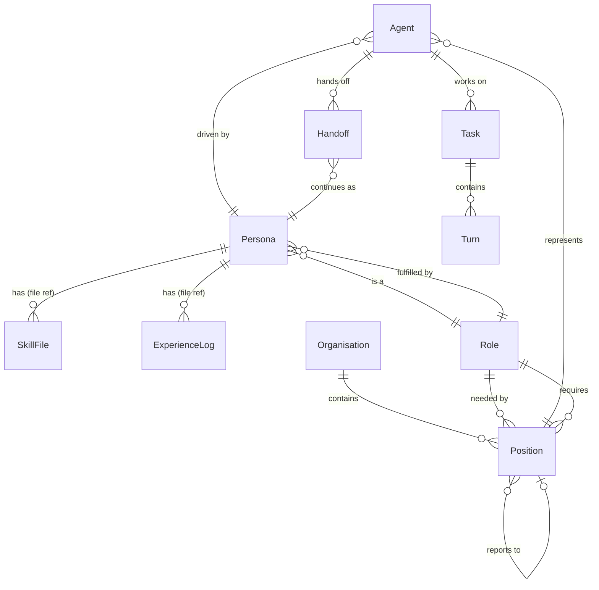

# Claude Headspace — Organisational Model ERD (Simplified)

**Date:** 17 February 2026
**Status:** Simplified view — entities and relationships only, no field details
**Revised:** Workshop review session — resolved integer PKs, shared Role lookup, dropped PositionAssignment/can_use_tools/availability constraint
**Note:** Agent, Task, and Turn are existing Headspace 3.1 entities. SkillFile and ExperienceLog are version-managed files in the `data/` directory, not database tables. See headspace-org-erd-full.md for field-level detail.

---

---

## Entity Summary

| Entity | Type | New or Existing |
|--------|------|-----------------|
| Role | DB table | New — shared lookup referenced by both Persona and Position |
| Persona | DB table | New — has slug, role_id FK for filesystem path generation |
| Organisation | DB table | New |
| Position | DB table | New (self-referential hierarchy, role_id FK) |
| Handoff | DB table | New |
| Agent | DB table | Existing — extended with persona_id, position_id |
| Task | DB table | Existing — unchanged |
| Turn | DB table | Existing — unchanged |
| SkillFile | File reference | Version-managed file at `data/personas/{slug}/skill.md` |
| ExperienceLog | File reference | Version-managed file at `data/personas/{slug}/experience.md` |

## Workshop Resolutions Applied

- **Integer PKs** throughout (matching existing codebase convention)
- **Role is a shared lookup table** — Persona.role_id and Position.role_id both reference Role. Position matching finds personas by shared role.
- **PositionAssignment dropped** — persona-to-position relationship is established through Agent (which has both persona_id and position_id). Status derived from agent status.
- **No availability constraint** — multiple agents can share the same persona simultaneously (duplicating a persona is advantageous, not a constraint to enforce)
- **Slug belongs to Persona** — generated from `{role}-{name}-{id}`, no multi-joins needed
