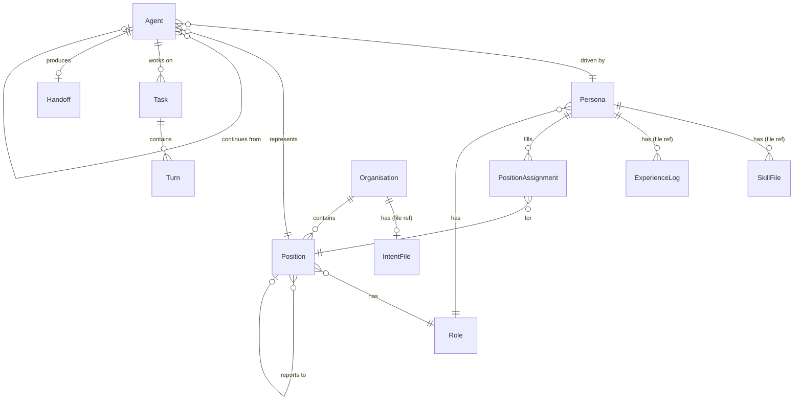

# Claude Headspace — Organisational Model ERD (Simplified)

**Date:** 16 February 2026 (updated 1 March 2026 — Organisation Workshop decisions)
**Status:** Simplified view — entities and relationships only, no field details
**Note:** Agent, Task, and Turn are existing Headspace 3.1 entities. SkillFile, ExperienceLog, and IntentFile are version-managed files, not database tables. See headspace-org-erd-full.md for field-level detail.

---

---

## Entity Summary

| Entity | Type | New or Existing |
|--------|------|-----------------|
| Persona | DB table | New (has slug: `{role}-{name}-{id}`) |
| Organisation | DB table | New (has purpose + slug: `{purpose}-{name}-{id}`) |
| Role | DB table | New (global, not org-scoped) |
| Position | DB table | New (self-referential hierarchy) |
| PositionAssignment | DB join table | New (lifecycle via timestamps, availability derived from Agent) |
| Handoff | DB table | New (content container, belongs to outgoing agent) |
| Agent | DB table | Existing — extended with persona_id, position_id, previous_agent_id (self-ref chain) |
| Task | DB table | Existing — unchanged |
| Turn | DB table | Existing — unchanged |
| SkillFile | File reference | Version-managed file at `data/personas/{slug}/skill.md` |
| ExperienceLog | File reference | Version-managed file at `data/personas/{slug}/experience.md` |
| IntentFile | File reference | Version-managed file at `data/organisations/{slug}/intent.md` |
