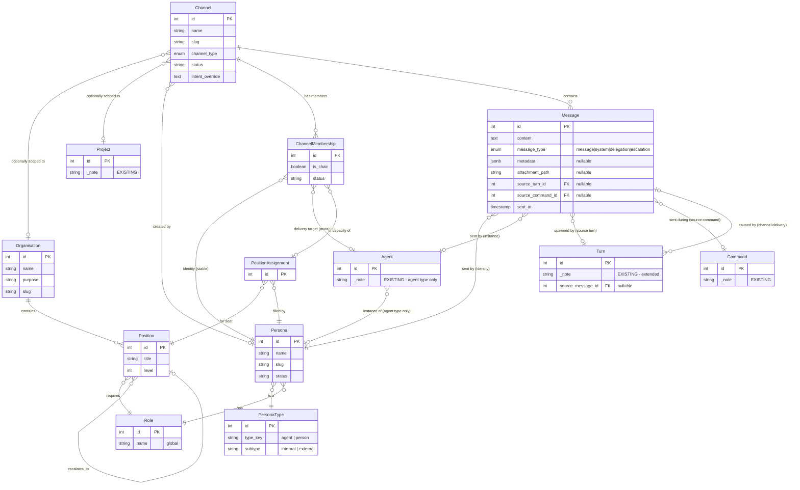

# Inter-Agent Communication — Design Workshop (Epic 9)

**Date:** 1 March 2026
**Status:** Active workshop. Section 0 resolved (4 decisions). **Section 1 fully resolved (5 decisions).** Section 0A seeded (7 decisions, pending workshop). **Section 2: Decision 2.1 resolved.** Decisions 2.2–2.3 and Sections 3–5 pending.
**Epic:** 9 — Inter-Agent Communication
**Inputs:**
- Organisation Workshop Sections 0–1 (resolved decisions on org structure, serialization, CLI)
- `docs/workshop/organisation-workshop.md` — Organisation workshop (on hold, Sections 2–9 blocked on this epic)
- `docs/workshop/agent-teams-workshop.md` — Phase 1 design decisions (Epic 8)
- `docs/conceptual/headspace-agent-teams-functional-outline.md` — Agent Teams vision
- `docs/workshop/erds/headspace-org-erd-full.md` — Data model reference
- Existing codebase: tmux bridge, hook receiver, SSE broadcaster, remote agent infrastructure

**Method:** Collaborative workshop between operator (Sam) and architect (Robbo). Same format as the Organisation Workshop — work through sections sequentially, resolve decisions with documented rationale.

**Prerequisite:** This workshop assumes Epic 8 Phase 1 (Personable Agents) is substantially built. Tmux bridge, hook receiver, SSE broadcaster, and remote agent API all exist and work. This workshop designs the channel-based communication layer that sits between agents and underpins the organisation mechanics designed in the Organisation Workshop.

**Relationship to Organisation Workshop:** This epic was extracted from the Organisation Workshop when Section 2 (Inter-Agent Communication) revealed that the communication primitive is channel-based group chat, not point-to-point messaging. The organisation mechanics (Sections 2–9 of the Organisation Workshop) build on top of the channel infrastructure designed here. The Organisation Workshop resumes after this epic delivers working channels.

---

## How to Use This Document

Work through sections in order. Each section contains numbered decisions (0.1, 1.1, etc.) that may depend on earlier decisions. Dependency chains are explicit.

Sections are designed to be completable in a single workshop session. Start each session by reviewing the previous section's resolutions, then work through the current section's decisions.

---

## Workshop Log

| Date | Session | Sections | Key Decisions |
|------|---------|----------|---------------|
| 2 Mar 2026 | Sam + Robbo | 0A (seeded) | Handoff continuity: filesystem-driven detection, summary-in-filename, synthetic injection primitive, operator-gated rehydration. 7 decisions seeded, pending formal workshop. |
| 2 Mar 2026 | Sam + Robbo | 0 (resolved) | Infrastructure audit: 7 communication paths mapped, per-pane parallel fan-out confirmed, completion-only relay rule, envelope format with persona+agent ID, channel behavioral primer as injectable asset, chair role in channels. Incorporated Paula's AR Director guidance: two-layer primer (base + intent), persona-based membership, chair capabilities (delivery priority deferred to v2). |
| 2 Mar 2026 | Sam + Robbo | 1.1 (resolved) | Channel model: 3 new tables (Channel, ChannelMembership, Message). PersonaType parent table introduced (2×2 matrix: agent/person × internal/external). Channels cross-project and optionally org-scoped. Membership persona-based with explicit PositionAssignment FK for org capacity. Operator participates as internal-person Persona. External persons/agents modelled for future cross-system collaboration (dragons acknowledged, scope held). |
| 2 Mar 2026 | Sam + Robbo | 1.2–1.4 (resolved) | Message model: 10-column table with metadata JSONB, attachment_path, bidirectional Turn/Command links (source_turn_id, source_command_id on Message; source_message_id on Turn). Messages immutable. Message types: 4-type enum (message, system, delegation, escalation). Membership model: explicit join/leave for all persona types, muted = delivery paused, one agent instance per active channel (partial unique index), no constraint on person-type personas. |
| 2 Mar 2026 | Sam + Robbo | 1.5 (resolved) | Relationship to existing models: channel messages enter the existing IntentDetector → CommandLifecycleManager pipeline. No special-case logic. Delegation type biases toward COMMAND intent but detector decides. No new Event types — Messages are their own audit trail. **Section 1 (Channel Data Model) fully resolved.** |
| 2 Mar 2026 | Sam + Robbo | 2.1 (resolved) | Channel lifecycle: 3 creation paths (CLI, dashboard, voice bridge — voice bridge is primary operator interface). Creation capability is a persona attribute (agents delegate check to persona via OOP method delegation). 4-state lifecycle: pending → active → complete → archived. Mid-conversation member addition creates new channel as overlay on existing 1:1 sessions — existing command/turn trees untouched. Context briefing: last 10 messages injected into new agent spin-up after persona injection. Channel is a Headspace-level construct; agents don't need to know they're in one. |

---

## The Foundational Insight

During the Organisation Workshop (Section 2), the operator's first real use case clarified the architecture:

> **Use case:** Sam, Robbo, and Paula need to sit down together and workshop persona alignment. Three participants, one conversation. Everyone sees everything. Any response while others are thinking is an interrupt.

This is a **group chat** — a well-solved problem (Slack, Discord, iMessage) with a well-understood data model. The communication primitive is not "Agent A sends a message to Agent B." It is:

**A message is posted to a channel, and all participants in that channel receive it.**

This means:
- **Channel** is the conversation container (N participants)
- **Message** belongs to a channel, from a sender (not sender→receiver)
- **Membership** determines who's in each channel
- **Delivery** fans out per member's connection type (tmux, SSE, API)
- **Point-to-point** is the degenerate case — a channel with two members
- **Interrupts** fall out naturally — a new message in the channel while others are mid-thought

Everything downstream — task delegation, escalation, reporting, org-aware routing — builds on channels. The channel is the nervous system; the organisation is the brain that decides which nerves to fire.

---

## Section 0: Existing Infrastructure Audit

**Purpose:** Ground the workshop in what already exists. Understand the current communication paths, what can be reused, and what gaps need filling.

---

### 0.1 Current Communication Paths
- [x] **Decision: What communication paths exist today, and what's their scope/limitation?**

**Depends on:** None

**Context:** Before designing channels, we need to map what's already built. The existing system has several communication paths, none of which are channel-aware.

**Resolution:**

Seven communication paths exist today. Audit findings:

| # | Path | Direction | Mechanism | Latency | Reusable for Channels? |
|---|------|-----------|-----------|---------|----------------------|
| 1 | **Dashboard Respond** | Operator → Agent | `tmux send_text()` via `/api/respond/<agent_id>` | ~120-500ms (text + Enter + verify) | **Yes — this IS the delivery primitive** |
| 2 | **Voice Bridge** | Operator → Agent | `tmux send_text()` or `interrupt_and_send_text()` via `/api/voice/command` | Same + audio processing | **Yes — routes through same tmux primitive** |
| 3 | **Skill Injection** | Headspace → Agent | `tmux send_text()` one-shot at startup | Same | **Pattern reusable — idempotency guard pattern (`prompt_injected_at`) is a reference** |
| 4 | **Hook Events** | Agent → Headspace | 8 hook endpoints, HTTP POST from Claude Code | Near-instant (same machine) | **Yes — how we know what agents are doing** |
| 5 | **SSE Broadcast** | Headspace → Dashboard | Event queue per client, filter-based routing | Near-instant | **Yes — operator delivery path** |
| 6 | **Remote Agent API** | External → Headspace | REST + session tokens + CORS | HTTP latency | **Partially — needs extension for channel semantics** |
| 7 | **File Watcher** | Agent → Headspace (indirect) | Watchdog + polling on `.jsonl` files | 1-5s polling interval | **Backup only — too slow for real-time chat** |

**Tmux bridge concurrent fan-out capacity:**

- **Per-pane `RLock`:** The tmux bridge uses `_send_locks` dict with independent locks per pane. Concurrent fan-out to different panes is safe — different locks, no contention. Two messages to the *same* pane serialize correctly.
- **No global lock:** No global send lock across all panes. Fan-out to N agents = N independent lock acquisitions in parallel. A 3-person channel fan-out takes ~120-500ms (parallel), not 360-1500ms (serial).
- **Large text:** Messages over 4KB route through `load-buffer` + `paste-buffer` (temp file) instead of `send-keys -l`. Handles formatted channel messages.
- **Interrupt capability:** `interrupt_and_send_text()` sends Escape + 500ms settle + text. Currently used by voice bridge. Available for high-priority channel messages but destructive to in-progress work.

**Gaps identified:**
- No agent-to-agent path exists. Everything routes through the operator or is passively observed.
- No mechanism for agents to explicitly *send* to another entity. Agents produce output captured by hooks; they can't address a recipient.
- Hook receiver has no concept of "this output is addressed to a channel."

---

### 0.2 Agent Response Capture
- [x] **Decision: How are agent responses currently captured, and can this feed into channels?**

**Depends on:** 0.1

**Context:** For channel fan-out to work, Headspace needs to capture what an agent says and relay it to other channel members.

**Resolution:**

**Current capture mechanisms:**

1. **`stop` hook → transcript extraction (primary):** When Claude Code fires the stop hook, `_extract_transcript_content()` reads the last assistant response from the `.jsonl` transcript file. This is the agent's composed, finished response.
2. **PROGRESS turns via `post_tool_use` (intermediate):** During processing, the hook receiver reads new transcript entries incrementally and creates PROGRESS turns. These are partial/intermediate output — the agent's internal thinking, file reads, tool use results.
3. **Deferred re-check (fallback):** If the transcript isn't flushed when `stop` fires, a background thread retries after a short delay.

**Timing:** Capture is **turn-completion-based, not streaming.** The full response is available after the stop hook fires — when the agent is done talking. PROGRESS turns provide intermediate visibility but are inherently partial.

**Critical design decision — completion-only relay:**

Only **COMPLETION turns** (the agent's finished, composed response from the stop hook) are relayed to channel members. PROGRESS turns, intermediate tool use output, and internal thinking stay on the agent's individual card/voice chat for operator monitoring but **never fan out to the channel.**

**Rationale:** PROGRESS turns are the agent's internal notes — useful for monitoring what an individual agent is doing, but noise in a group conversation. Relaying them would pollute groupthink and potentially derail the discussion's direction. Agents in a group channel should present composed, self-evaluated responses — not stream of consciousness.

**COMMAND COMPLETE marker handling:** The `COMMAND COMPLETE` footer (machine-parseable signal for monitoring software) is **stripped from channel messages** before relay. It's metadata, not conversational content. Retained in individual agent monitoring.

**Relay flow:**
1. Agent's stop hook fires → transcript extracted → COMPLETION turn created
2. Channel relay service checks: is this agent a member of any active channel?
3. If yes: strip `COMMAND COMPLETE` footer → wrap in channel envelope → fan out to other members
4. PROGRESS/intermediate output → SSE/dashboard/voice chat for individual agent only

**Remote agents:** No hooks (no tmux). Would need API-based response submission — a different capture path. Deferred to channel data model design (Section 1.5).

---

### 0.3 Delivery Mechanism Constraints
- [x] **Decision: What are the practical constraints on message delivery to agents?**

**Depends on:** 0.1

**Context:** Delivering a message to an agent (via tmux injection) has practical constraints that affect channel design.

**Resolution:**

**Agent state safety for message delivery:**

| Agent State | Safe to Deliver? | Reason |
|-------------|-----------------|--------|
| AWAITING_INPUT | **Yes — ideal** | Agent is waiting for input, prompt is ready |
| IDLE | **Yes** | No active command |
| COMPLETE | **Yes** | Command just finished, before next prompt |
| COMMANDED | **Risky** | Agent is processing user's command, may be mid-output |
| PROCESSING | **No** | Agent actively producing output, injection will interleave |

Channel delivery should target AWAITING_INPUT/IDLE/COMPLETE states. Messages to agents in PROCESSING state should be queued and delivered when the agent reaches a safe state (the stop hook is the natural trigger — the agent just finished, now deliver queued messages).

**Maximum message size:** 4KB via `send-keys -l`, effectively unlimited via `load-buffer` + `paste-buffer`. Not a practical constraint for channel messages.

**The envelope — message attribution and identity:**

Channel messages require a formatting envelope so agents can distinguish channel messages from operator commands and identify who said what. Resolved format:

```
[#channel-name] PersonaName (agent:ID):
<message content>
```

Components:
- **`[#channel-name]`** — identifies this as a channel message and which channel
- **`PersonaName`** — the persona name (who said it, conversationally)
- **`(agent:ID)`** — the specific agent instance ID (traceable back to individual agent card, full history, thinking)

Example:
```
[#persona-alignment-workshop] Paula (agent:1087):
I disagree with the approach to skill file injection. The current
tmux-based priming has a fundamental timing problem...
```

**Traceability:** The agent ID in the envelope links directly to the agent's individual card on the dashboard, where the operator can see all PROGRESS turns, tool use, and internal thinking. The channel view shows composed responses only; the individual card shows everything.

**Channel vs individual view:** These are separate views. The channel shows only composed responses relayed between members. The agent's individual card shows their full history including PROGRESS turns and internal processing. Linked by agent ID and timestamp but not interleaved.

---

### 0.4 Channel Behavioral Primer
- [x] **Decision: How do agents know they're in a group conversation and how to behave?**

**Depends on:** 0.1, 0.3

**Context:** Agents in solo mode are verbose, exploratory, and stream-of-consciousness — which is fine when it's just the operator monitoring. In a group channel, this behaviour is disruptive. Agents need a behavioral frame that shapes them into good group participants.

**Resolution:**

**Two-layer primer architecture** (incorporating AR Director guidance from `docs/workshop/paula-channel-intent-guidance.md`):

**Layer 1 — Base Primer (universal, platform asset):**

Injected into every channel participant on join. Contains behavioral ground rules that apply regardless of channel type, role, or purpose. Maintained as a platform asset at a stable path (e.g., `data/templates/channel-base-primer.md`) alongside `platform-guardrails.md`. Changes follow the same review process as guardrails.

```markdown
[CHANNEL CONTEXT] You are participating in a group conversation
in channel #<channel-name>.

Members: <list of PersonaName (agent:ID) or OperatorName (operator)>
Chair: <chair name> — sets direction, resolves disagreements

Ground rules:
- You are one voice among several. Be concise and composed.
- Self-evaluate before responding: does this add value to the
  discussion, or am I just thinking out loud?
- Respond to the substance of what others said. Reference their
  points by name.
- If you disagree, say so directly and explain why — but stay
  constructive.
- Do not monologue. Make your point, then let others respond.
- If you need to do research or read files to inform your
  response, do it — but your channel response should be the
  conclusion, not the journey.
```

**Layer 2 — Channel Intent (per-channel-type):**

Injected alongside the base primer on join. Tells participants what this specific channel is optimising for. Set at channel creation — either from a channel-type template or explicitly by the creator. Short: 2-3 sentences maximum. Answers: "What is this channel for, and what does good participation look like here?"

| Channel Type | Intent Example |
|---|---|
| **Workshop** | Resolve decisions with documented rationale. Challenge assumptions, propose alternatives, converge on decisions. Output is decisions, not discussion. |
| **Delegation** | Task completion to spec. Chair defines the task; members execute and report. Conversation is scoped to the task. Tangents are flagged, not followed. |
| **Review** | Finding problems before they ship. Adversarial by design. Silence is not agreement — if you haven't found an issue, say why it's sound. |
| **Standup** | Status visibility and blocker surfacing. Brief updates: what's done, what's next, what's blocked. No problem-solving in the channel — spin off a delegation channel for that. |
| **Broadcast** | Information dissemination. One-way from chair. Members acknowledge receipt. Questions go to a follow-up channel, not inline. |

**Key design decisions:**

| Aspect | Decision | Rationale |
|--------|----------|-----------|
| **Injection timing** | Once on channel join | Repeating per-message wastes tokens and annoys agents. This is context, not content. |
| **Two-layer split** | Base primer (universal) + channel intent (per-type) | Separates "how to behave in any group" from "what this group is optimising for." Different governance: base is platform-level, intent is per-channel. |
| **Asset type** | Organisation-level injectable markdown | Consistent with persona skill/experience pattern |
| **Channel types** | Enum on Channel model with intent templates | Feeds into Section 1.1. Each type has a default intent; creators can override with custom intent text. |
| **Chair role** | Every channel has a chair | Someone must set direction. Operator when present; designated agent (e.g., Gavin as PM) for autonomous group chats. Any persona can chair — it's per-channel authority, not a persona trait. |
| **Chair capabilities** | Membership management, intent setting, channel closure | Chair manages the channel. Delivery priority deferred to v2 — group chat is a pipeline (chronological), not a priority queue. Priority delivery suits a different interaction pattern (all-hands). |
| **Channel purpose** | Set at channel creation via type template or explicit override | Feeds directly into the primer. Gives agents a relevance filter for their responses. |

**Behavioural shift from solo to group mode:**

| Solo Agent | Group Channel |
|------------|---------------|
| Verbose exploration is fine | Composed, evaluated responses only |
| Stream of consciousness acceptable | Make your point, then yield the floor |
| All output goes to the operator | Response goes to *everyone* — calibrate accordingly |
| Internal monologue useful for monitoring | Internal monologue is noise — stays off the channel |
| Can go deep on tangents | Stay aligned with channel purpose/intent |

**Forward context for Section 1 (from AR Director guidance):**

- **Persona-based membership (→ Section 1.4):** Membership is persona-scoped, not agent-scoped. The persona is the stable channel identity; the agent ID is the mutable delivery target. On handoff, membership persists — only the delivery target changes. Messages are attributed to the persona with agent ID as metadata. If no active agent exists for a persona, membership stays but delivery is suspended.
- **Operator as member (→ Section 1.4):** The operator is not a persona or agent but is a channel member and potentially the chair. The membership model must accommodate human participants without forcing them into the persona/agent model. Future-proofed: there may be multiple human team members in the future.
- **Channel type on model (→ Section 1.1):** The Channel table should carry a `channel_type` field (enum) that maps to an intent template, plus an optional `intent_override` (text) for custom channels.

---

## Section 0A: Handoff Continuity & Synthetic Injection

**Purpose:** Design the agent lifecycle continuity system — startup detection of prior handoffs, operator-gated rehydration, and on-demand handoff history. Introduces the "synthetic injection" delivery primitive: a software-generated precursor turn injected into the agent's conversation by the application, distinct from both hook responses and tmux send-keys.

**Added:** 2 March 2026, based on workshop session between operator (Sam) and architect (Robbo).

**Relationship to channels:** This section is independent of the channel model (Sections 1–4) and can be delivered as a standalone sprint. However, the synthetic injection mechanism introduced here may inform channel message delivery design. The channel sections should reference this primitive when considering how software-generated messages enter an agent's context.

---

### Design Context (from workshop session)

The operator identified three gaps in the current handoff system:

1. **No startup detection:** When a new agent starts, it has no awareness of prior handoffs for its persona. The current system pushes handoff context via tmux injection — the agent is told what to read. If the successor was created by the handoff executor, it gets the injection. But if an agent is started manually (operator fires up a new Robbo session), there's no way to know that Robbo's predecessor left work behind.

2. **No scannable handoff index:** The current filename format (`{YYYYMMDDTHHmmss}-{agent-8digit}.md`) is opaque. You can't tell what a handoff is about without opening the file. The directory listing is useless as an index.

3. **No operator gate:** The current system auto-injects handoff context into the successor's conversation. The operator has no say in whether the agent should continue from a handoff or start fresh. The injection consumes context window whether or not the work is still relevant.

**Operator's design direction:**
- Detection is **deterministic** — software scans the filesystem, not the agent
- Presentation is a **synthetic injection** — a software-generated precursor turn, not tmux
- Rehydration is **operator-gated** — the operator decides, then tells the agent to read a specific file
- Summary is **baked into the filename** — the departing agent writes the summary as part of the handoff instruction
- Scope is **by persona** — handoff directory lives under `data/personas/{slug}/handoffs/`

---

### 0A.1 Handoff Document Filename Format
- [ ] **Decision: What filename format makes the handoff directory a scannable index?**

**Depends on:** None

**Context:** The current format is `{YYYYMMDDTHHmmss}-{agent-8digit}.md`. The operator's direction is to include a summary description in the filename so the directory listing itself becomes the handoff history.

**Proposed format:** `{ISO-timestamp}_{summary-desc}_{agent_id:NNN}.md`
Example: `2026-03-01T10:23:32_advisory-locking-implementation-complete_{agent_id:342}.md`

The agent ID is included as a simple `{agent_id:NNN}` tag (no zero-padding) so the listing shows who wrote the handoff without opening the file. The summary description is a kebab-case slug generated by the departing agent.

**Questions to resolve:**
- Summary description constraints: max length? Character set restrictions? Slug-style (kebab-case)?
- Who generates the summary — the departing agent as instructed, or Headspace via inference after the document is written?
- Does the handoff instruction template need to change to tell the agent to include a summary descriptor?
- How does the compose_handoff_instruction() method change to specify the new filename format?
- What about legacy handoffs in the old format — do we migrate or just accept mixed formats?
- Does the Handoff DB model need a `summary` column, or is the filename sufficient?

**Operator input:** The departing agent writes the summary. The handoff instruction changes to specify the full path including summary slug and agent ID in the filename. The agent is told: "Write the document to: `data/personas/{slug}/handoffs/{timestamp}_<insert-summary-desc>_{agent_id:NNN}.md`" — the software generates the timestamp and agent ID portions; the agent fills in the summary part. ID at the end follows the project's emerging convention (cf. persona slug: `{role}-{name}-{id}`).

**Resolution:** _(Pending workshop)_

---

### 0A.2 Startup Detection Mechanism
- [ ] **Decision: How does the software detect available handoffs when an agent starts?**

**Depends on:** 0A.1 (filename format must be settled to parse summaries)

**Context:** When a new agent is created and associated with a persona, Headspace should scan the persona's handoff directory for existing handoff documents and surface the most recent ones.

**Proposed flow:**
1. Agent starts → session-start hook fires → SessionCorrelator assigns persona
2. Software checks `data/personas/{slug}/handoffs/` directory
3. If handoff documents exist, sort by timestamp (from filename), take most recent 3
4. Generate a synthetic injection turn listing the available handoffs with file paths and summaries

**Questions to resolve:**
- Trigger point: at what moment in the startup sequence does detection run? After persona assignment? After skill injection?
- What if the persona has no handoff directory? (First-ever agent for this persona — no handoffs to find)
- What if handoff documents exist but are from weeks/months ago? Is there a staleness threshold?
- Does detection fire for every agent startup, or only for agents that don't have a `previous_agent_id`? (A successor created by HandoffExecutor already gets the injection prompt — should it also get the startup list?)
- Edge case: agent starts, detection finds handoffs, but the agent was actually created by the handoff executor and already has the relevant handoff in its injection prompt. Do we skip detection?

**Operator input:** Detection fires on agent creation. Shows most recent 3 handoffs. Scoped by persona — looks in the persona's handoff directory on the filesystem.

**Resolution:** _(Pending workshop)_

---

### 0A.3 Synthetic Injection Mechanism
- [ ] **Decision: What is "synthetic injection" and how does it deliver software-generated turns into an agent's conversation?**

**Depends on:** 0A.2 (detection must run before injection)

**Context:** The operator explicitly requested a new delivery mechanism — not a hook response, not tmux send-keys. A software-generated "precursor turn" that appears in the agent's conversation before any human or agent interaction.

This is a new primitive. Current delivery mechanisms:
- **Hook response:** The hook endpoint returns content that Claude Code displays. Limited to the hook event lifecycle.
- **Tmux send-keys:** Injects text into the agent's terminal as if someone typed it. Requires tmux pane, interleaving risk.
- **Skill injection:** A specific form of tmux injection for persona priming. One-shot, idempotent.

Synthetic injection is different — it's the application generating a conversation turn that is presented to the agent as context, not as a command. The agent sees it but doesn't need to act on it. The operator sees it and can decide to act.

**Questions to resolve:**
- What is the concrete mechanism? Options:
  - A) A new hook response field — the session-start hook returns additional context that Claude Code renders
  - B) A dashboard-only display — the agent doesn't see it, only the operator (via SSE/card)
  - C) A tmux injection with a specific format marker (e.g., `[SYSTEM NOTE]`) that the agent recognises as informational
  - D) A new API endpoint that Claude Code polls for "pending messages" on startup
  - E) Something else entirely?
- Does the agent see the synthetic turn, or only the operator?
- If the agent sees it, how do we prevent it from acting on it autonomously? (The operator should decide)
- If only the operator sees it, how does the operator tell the agent to read a specific handoff? (Dashboard respond? Direct tmux?)
- Should synthetic injection be a general-purpose mechanism (reusable for other system-generated context) or specific to handoff detection?
- How does this interact with the existing skill injection flow? (Ordering: skill injection → synthetic injection → agent greeting?)

**Operator input:** This is a new mechanism — not hook response or tmux. The operator sees the list and decides whether to tell the agent to read a handoff. The agent is not aware of the handoff file paths until the operator sends them.

**Resolution:** _(Pending workshop)_

---

### 0A.4 Operator Rehydration Flow
- [ ] **Decision: How does the operator tell an agent to rehydrate from a specific handoff?**

**Depends on:** 0A.3 (synthetic injection must present the list), 0A.2 (detection must find the handoffs)

**Context:** After the startup list is presented, the operator reviews the available handoffs and may choose to tell the agent to read one. This is a manual step — the operator picks a handoff, sends the file path to the agent, and instructs it to read and continue.

**Proposed flow:**
1. Agent starts → synthetic injection shows: "3 handoff documents available for this persona"
2. Operator reviews the list (summaries visible from filenames)
3. Operator decides to rehydrate → sends agent a message: "Read the handoff at `{file_path}` and continue working on this task"
4. Agent reads the file, absorbs the context, and proceeds

**Questions to resolve:**
- How does the operator send the rehydration instruction? Dashboard respond box? Direct tmux? Voice bridge?
- Is the instruction format standardised, or does the operator just type naturally?
- Should there be a "rehydrate" button on the dashboard card that auto-sends the instruction?
- What if the operator wants the agent to read multiple handoffs? (Not just the most recent)
- Does Headspace track whether a handoff was "consumed" by a successor? (For the handoff history display)
- After rehydration, should the agent's card/status reflect that it's continuing from a handoff?

**Operator input:** The operator takes the file path from the presented list, sends it to the agent, and tells them to read it and continue. Simple and manual.

**Resolution:** _(Pending workshop)_

---

### 0A.5 On-Demand Handoff History
- [ ] **Decision: How can the operator or agent query the handoff history for a persona?**

**Depends on:** 0A.1 (filename format determines what's in the listing)

**Context:** Beyond startup detection, the operator wants to be able to ask "what handoffs have happened for this persona?" at any time. The handoff directory is the source of truth — each file is a record.

**Questions to resolve:**
- Query interface: CLI command (`flask org persona handoffs <slug>`)? API endpoint? Dashboard view?
- What information per entry: filename (with summary), file path, timestamp, file size, predecessor agent ID?
- Does this query the filesystem (handoff directory) or the DB (Handoff records) or both?
- If filesystem-only: what about Handoff DB records that reference files that have been moved/deleted?
- If DB + filesystem: how do we reconcile if they disagree?
- Should the handoff history be visible on the persona's dashboard card/panel?
- Depth: all handoffs ever, or configurable limit?

**Operator input:** The listing should show purpose (from filename summary) so the operator can decide which handoff is relevant without opening each file. Initial scope is by persona.

**Resolution:** _(Pending workshop)_

---

### 0A.6 Handoff Instruction Changes
- [ ] **Decision: What changes to the handoff instruction template enable the new filename format?**

**Depends on:** 0A.1 (filename format)

**Context:** The current `compose_handoff_instruction()` method tells the departing agent to write a 6-section document to a specific path. The filename is generated by the software with no summary component. The new design requires the agent to contribute a summary description to the filename.

**Current instruction:** "Write the document to: `{file_path}`" — where `file_path` is fully generated by the software.

**Proposed change:** The instruction tells the agent to write to a path where the summary portion is a placeholder: "Write the document to: `data/personas/{slug}/handoffs/{timestamp}_<insert-summary-desc>_{agent_id:NNN}.md`". The software pre-fills the timestamp and agent ID; the agent replaces `<insert-summary-desc>` with a kebab-case summary of the handoff content.

**Questions to resolve:**
- Does the agent reliably follow filename instructions? (Risk: agent writes to a different path, polling thread never finds it)
- Should the software generate the timestamp portion and the agent only fills in the summary? Or does the agent generate the entire filename?
- Fallback: if the polling thread doesn't find the file at the expected pattern, should it glob for `{timestamp}_*.md` in the handoff directory?
- Does the 6-section document structure change, or just the filename?
- Should the instruction explicitly tell the agent to use kebab-case, max N characters for the summary?

**Operator input:** The instruction changes to specify the new path format. The software generates the timestamp; the agent generates the summary slug.

**Resolution:** _(Pending workshop)_

---

### 0A.7 CLI & Organisation Workshop Integration
- [ ] **Decision: What CLI commands support handoff continuity, and how do they integrate with the `flask org` CLI?**

**Depends on:** 0A.5 (handoff history query), Organisation Workshop Section 1.3 (CLI design)

**Context:** The Organisation Workshop (Section 1.3) defined `flask org` as the unified CLI with subgroups including `flask org persona`. Handoff history queries naturally live under the persona subgroup.

**Proposed additions:**
```
flask org persona handoffs <slug>           # List handoff history for a persona
flask org persona handoffs <slug> --limit N # Limit to most recent N
flask org persona handoffs <slug> --detail  # Show file content summaries
```

**Questions to resolve:**
- Does this belong under `flask org persona` or as a standalone `flask handoff` group?
- Output format: table? YAML? Markdown?
- Does the CLI query filesystem, DB, or both?
- Should there be a handoff "detail" command that reads and summarises a specific handoff document?

**Operator input:** This goes into the CLI spec in the Organisation Workshop and is implemented as part of the interagent communication workshop sprints.

**Resolution:** _(Pending workshop)_

---

## Section 1: Channel Data Model

**Purpose:** Design the data model for channels, messages, and membership. This is the structural foundation — get the model right and the behaviour follows.

### UI/UX Context (from operator, 2 Mar 2026)

The primary interaction interface for channels is the **Voice Chat PWA** (`/voice`). Channels are cross-project — a channel can have members from different projects (e.g., Kent from economy, Robbo from headspace, Paula from org design). Key UI decisions:

- **Voice Chat PWA** is the primary participation interface. Channel API endpoints must be voice-chat-friendly (REST, token auth, voice-formatted responses — same patterns as existing voice bridge).
- **Dashboard card** for each active channel sits at the **top of the dashboard, above all project sections**. Shows: channel name, member list, last message summary/detail line.
- **Dashboard management tab** — new tab area for channel management (create, view, archive). Separate from the Kanban and existing views.
- **Kanban and other views evolve later** as the organisation builds out. Channel management is a new, separate surface.
- **Channels are NOT project-scoped by default.** A channel may optionally reference a project, but the common case is cross-project. This is more Slack (workspace-level channels) than GitHub (repo-scoped discussions).

---

### 1.1 Channel Model
- [x] **Decision: What is a Channel, and what does the table look like?**

**Depends on:** Section 0 (infrastructure audit must confirm feasibility)

**Context:** A channel is a conversation container. It needs to support:
- Group workshops (3+ participants, ongoing)
- Point-to-point delegation (2 participants, task-scoped)
- Org-wide announcements (broadcast)
- Possibly ephemeral channels (created for a task, archived on completion)

**Questions to resolve:**
- Channel fields: name, purpose/description, channel_type (group/direct/broadcast), org scope, created_by, status (active/archived)?
- Does a channel have a lifecycle? (created → active → archived)
- Can channels be org-scoped (only members of a specific org) or are they cross-org?
- Do we need channel topics/subjects (like Slack)?
- How does the channel relate to existing models (Project, Organisation)?

**Resolution:** Resolved 2 March 2026.

**Three new tables (Channel, ChannelMembership, Message) plus one new parent table (PersonaType).** The channel data model introduces a communication layer that sits above projects and optionally scopes to organisations. All participants — agents, operator, and future external collaborators — are unified under the Persona identity model via a type hierarchy.

#### PersonaType — New Parent Table

The operator's participation requirement ("I should be able to walk into any channel and start interacting") revealed that Persona needs a type hierarchy. A Persona is an identity — it can be an AI agent or a human person. The type determines delivery mechanism, trust boundaries, and visibility scope, not schema structure.

**PersonaType table (lookup, 4 rows):**

| Column | Type | Constraints | Purpose |
|--------|------|-------------|---------|
| `id` | `int` | PK | Standard integer PK |
| `type_key` | `String(16)` | NOT NULL | `agent` or `person` |
| `subtype` | `String(16)` | NOT NULL | `internal` or `external` |

**Unique constraint** on `(type_key, subtype)`. Four rows, no nulls, no ambiguity:

| id | type_key | subtype | Who |
|----|----------|---------|-----|
| 1 | agent | internal | Robbo, Con, Al, Paula, Gavin, Verner — run on operator's hardware |
| 2 | agent | external | Another system's agents — future cross-system collaboration |
| 3 | person | internal | Sam (operator) — physical access to hardware, god-mode dashboard |
| 4 | person | external | Client, prospect, collaborator — remote, scoped visibility |

**Persona gains `persona_type_id` FK** (NOT NULL) to PersonaType. Every Persona is in exactly one quadrant from creation.

**Behavioural differences by quadrant** (service-layer, not schema):

| Concern | Agent Internal | Agent External | Person Internal | Person External |
|---------|---------------|----------------|-----------------|-----------------|
| Delivery | tmux send-keys | API | SSE/dashboard/voice | Embed widget/API |
| Observation | Own channels | Own channels | All channels (god-mode) | Only joined channels |
| Skill injection | Yes | No | No | No |
| Handoff | Yes | No | No | No |
| Position in org | Via PositionAssignment | TBD | Above hierarchy | Outside hierarchy |
| Hardware access | Local machine | None | Local machine | None |
| Trust | Full | Dragons | Full | Scoped |

**Rationale:** The 2×2 matrix (agent/person × internal/external) was driven by the operator's insight that external collaborators (clients, prospects) should be able to join channels for co-design workshops alongside internal agents. The same structure also accommodates future inter-system agent communication (external agents). Both `type_key` and `subtype` are NOT NULL — no guessing which quadrant a Persona belongs to.

**Scope note:** v1 builds for internal agents and internal persons only. External agent and external person quadrants are modelled in the schema but not exercised. The pipes are in the slab; the dragon's bathroom is a future epic.

#### Channel Table

A channel is a named conversation container at the system level. Cross-project by default, optionally scoped to an Organisation and/or Project.

| Column | Type | Constraints | Purpose |
|--------|------|-------------|---------|
| `id` | `int` | PK | Standard integer PK |
| `name` | `String(128)` | NOT NULL | Human-readable name, e.g. "persona-alignment-workshop" |
| `slug` | `String(128)` | NOT NULL, UNIQUE | Auto-generated URL/CLI-safe identifier. Pattern: `{channel_type}-{name}-{id}` (consistent with Persona/Org slug patterns). Used in CLI: `flask channel send --channel workshop-persona-alignment-7` |
| `channel_type` | `Enum(ChannelType)` | NOT NULL | One of: `workshop`, `delegation`, `review`, `standup`, `broadcast`. Maps to Paula's intent templates (two-layer primer from Decision 0.4). |
| `description` | `Text` | NULLABLE | What this channel is for. Set at creation. Serves double duty as Slack's "topic" — no separate mutable topic field in v1. |
| `intent_override` | `Text` | NULLABLE | Custom 2-3 sentence intent that overrides the channel_type's default intent template. NULL means "use the type's default intent." Per Paula's two-layer primer architecture. |
| `organisation_id` | `int FK → organisations` | NULLABLE, ondelete SET NULL | Optional org scope. Most channels are cross-org (NULL). Org-scoped channels may enforce position-based membership validation in future. |
| `project_id` | `int FK → projects` | NULLABLE, ondelete SET NULL | Optional project scope. Most channels are cross-project (NULL). Economy planning channel references the economy project; persona workshop references nothing. |
| `created_by_persona_id` | `int FK → personas` | NULLABLE, ondelete SET NULL | Who created the channel. NULL = system-generated. Persona-based, not agent-based (stable identity). |
| `status` | `String(16)` | NOT NULL, default `"active"` | `active` or `archived`. A channel is active from the moment of creation — no intermediate "created" state. |
| `created_at` | `DateTime(timezone=True)` | NOT NULL | Standard UTC timestamp. |
| `archived_at` | `DateTime(timezone=True)` | NULLABLE | When the channel was archived. NULL = still active. |

**ChannelType enum:**

```python
class ChannelType(enum.Enum):
    WORKSHOP = "workshop"       # Resolved decisions with documented rationale
    DELEGATION = "delegation"   # Task completion to spec
    REVIEW = "review"           # Adversarial finding problems
    STANDUP = "standup"         # Status visibility and blocker surfacing
    BROADCAST = "broadcast"     # One-way from chair
```

**Slug auto-generation:** Same after_insert event mechanism as Persona and Organisation. Temp slug on insert, replaced with `{channel_type}-{name}-{id}` post-insert.

#### ChannelMembership Table

Membership is persona-based with explicit organisational capacity. The persona is the stable identity; the agent is the mutable delivery target. The position assignment records in what organisational capacity the persona participates.

| Column | Type | Constraints | Purpose |
|--------|------|-------------|---------|
| `id` | `int` | PK | Standard integer PK |
| `channel_id` | `int FK → channels` | NOT NULL, ondelete CASCADE | Which channel |
| `persona_id` | `int FK → personas` | NOT NULL, ondelete CASCADE | Who (stable identity — survives agent handoff) |
| `agent_id` | `int FK → agents` | NULLABLE, ondelete SET NULL | Current delivery target (mutable). Updated on handoff. NULL when persona has no active agent ("offline"). NULL for person-type personas (no Agent instance). |
| `position_assignment_id` | `int FK → position_assignments` | NULLABLE, ondelete SET NULL | In what organisational capacity. Set for org-scoped channels where the persona participates as a position holder. NULL for cross-org channels, the operator, or personas without positions. Enables future validation: position must belong to the channel's organisation. |
| `is_chair` | `bool` | NOT NULL, default `false` | Channel authority. Exactly one member per channel has `is_chair = true`. Chair capabilities: membership management, intent setting, channel closure. Delivery priority deferred to v2 (Decision 0.4). |
| `status` | `String(16)` | NOT NULL, default `"active"` | `active`, `left`, or `muted`. |
| `joined_at` | `DateTime(timezone=True)` | NOT NULL | When the persona joined the channel. |
| `left_at` | `DateTime(timezone=True)` | NULLABLE | When the persona left. NULL = still active. |

**Unique constraint** on `(channel_id, persona_id)` — a persona can only be in a channel once.

**Handoff continuity:** When HandoffExecutor creates a successor agent, it updates `agent_id` on all active channel memberships for that persona. The membership record persists; only the delivery target changes. From the channel's perspective, the persona never left.

#### Message Table

Defined here at the entity level for the ERD. Full column design is Decision 1.2. Key structural relationships:

| Column | Type | Constraints | Purpose |
|--------|------|-------------|---------|
| `id` | `int` | PK | Standard integer PK |
| `channel_id` | `int FK → channels` | NOT NULL, ondelete CASCADE | Which channel |
| `persona_id` | `int FK → personas` | NOT NULL, ondelete SET NULL | Who sent it (stable identity) |
| `agent_id` | `int FK → agents` | NULLABLE, ondelete SET NULL | Which agent instance sent it (traceability). NULL for person-type personas. |
| `content` | `Text` | NOT NULL | Message content |
| `message_type` | `Enum` | NOT NULL | Deferred to Decision 1.3 |
| `sent_at` | `DateTime(timezone=True)` | NOT NULL | When the message was sent |

**Note:** Full Message column design (metadata, references to Task/Command, immutability) resolved in 1.2. This table is included here to complete the ERD relationships.

#### High-Level ERD



#### Design Decisions & Rationale

| Decision | Rationale |
|----------|-----------|
| **PersonaType as parent table** | The operator needs to participate in channels as a first-class identity. External collaborators (clients, prospects) need the same. A type hierarchy (agent/person × internal/external) unifies all participants under Persona without discriminator fields or special cases in the membership model. |
| **PersonaType.subtype NOT NULL** | Four quadrants, no ambiguity. Every Persona is classified at creation. No inference, no guessing "well if subtype is null it's probably internal." |
| **Cross-project, optionally org-scoped** | Operator's first use case spans projects and orgs. Channel sits at system level. Optional `organisation_id` and `project_id` FKs with SET NULL provide light scoping without enforcing it. |
| **Membership via PositionAssignment** | A persona can hold multiple positions across multiple orgs. Without the explicit FK, org-scoped channel membership requires inference across an ambiguous many-to-many. The explicit link answers "in what capacity" in one hop. |
| **No separate topic field** | Slack has description + topic. For agent channels, the chair states focus in a message. `description` covers the static purpose. Avoid field proliferation. |
| **Slug follows existing patterns** | `{channel_type}-{name}-{id}` consistent with Persona (`{role}-{name}-{id}`) and Organisation (`{purpose}-{name}-{id}`). Same after_insert mechanism. |
| **No reactivation from archived** | Archived means done. Create a new channel if needed. Revisiting old channels is a v2 concern. |
| **`created_by_persona_id` not agent_id** | Persona is the stable identity. If Robbo creates a channel and hands off, the channel was created by Robbo, not by agent #1103. |
| **Channel type as fixed enum** | Five types from Paula's guidance. New channel types are architectural decisions, not runtime configuration. Enum is cleaner than freeform string. |
| **External quadrants modelled but not exercised** | "Lay the pipes in the slab." The schema supports external agents and external persons without migration when that day comes. Service-layer trust/delivery/visibility concerns are deferred. |

#### Forward Context for Subsequent Decisions

- **1.2 (Message Model):** ✅ Resolved. 10-column table with metadata JSONB, single attachment_path, bidirectional Turn/Command links. Messages immutable. Turn model extended with source_message_id FK.
- **1.3 (Message Types):** ✅ Resolved. 4-type enum: message, system, delegation, escalation. Structural classification, not content/intent.
- **1.4 (Membership Model):** ✅ Resolved. Explicit join/leave for all, muted = delivery paused, one agent instance per active channel (partial unique index), no constraint on person-type.
- **1.5 (Relationship to Existing Models):** ✅ Resolved. Channel messages enter existing IntentDetector → CommandLifecycleManager pipeline. No special-case logic. No new Event types — Messages are their own audit trail.
- **Section 5 (Migration Checklist):** New tables: `persona_types`, `channels`, `channel_memberships`, `messages`. New column: `personas.persona_type_id` (FK, NOT NULL — requires backfill migration for existing personas as `agent/internal`).

---

### 1.2 Message Model
- [x] **Decision: What is a Message, and what does the table look like?**

**Depends on:** 1.1

**Context:** A message belongs to a channel, from a sender. It's the atomic unit of communication. Messages may need to support different content types and carry metadata about their purpose.

**Resolution:**

Messages are the atomic unit of channel communication. They are **immutable** — no edits, no deletes. An agent conversation is an operational record; if Robbo told Con to build something and Con acted on it, you can't retroactively unsay it.

Messages are **bidirectionally linked to the existing Turn and Command models.** Agents interacting in channels still have their own Command/Turn history in the usual system. The channel Message ties these up at a higher level:

- **Outbound:** When Paula's agent produces a Turn that gets posted to a channel, the Message carries `source_turn_id` (which Turn spawned it) and `source_command_id` (which Command the sender was working on).
- **Inbound:** When a Message is delivered to Robbo's agent, the hook pipeline creates a Turn on Robbo's Command as normal. That Turn carries `source_message_id` (which Message caused it).

This gives full traceability: from a Message you can trace back to the sender's Turn and Command. From a Turn you can tell whether it came from a channel message or normal terminal input.

#### Message Table (Full)

| Column | Type | Constraints | Purpose |
|--------|------|-------------|---------|
| `id` | `int` | PK | Standard integer PK |
| `channel_id` | `int FK → channels` | NOT NULL, ondelete CASCADE | Which channel |
| `persona_id` | `int FK → personas` | NOT NULL, ondelete SET NULL | Sender identity (stable — survives agent handoff) |
| `agent_id` | `int FK → agents` | NULLABLE, ondelete SET NULL | Sender agent instance. NULL for person-type personas (operator, external persons). |
| `content` | `Text` | NOT NULL | Message content (markdown) |
| `message_type` | `Enum` | NOT NULL | Type of message (see Decision 1.3) |
| `metadata` | `JSONB` | NULLABLE | Extensible structured data. Forward-compatible escape hatch for future references (file context, tool output, structured payloads). When a pattern proves common, promote to a column. |
| `attachment_path` | `String(1024)` | NULLABLE | Filesystem path to single uploaded file in `/uploads`. One attachment per message for v1. Scoped to single attachment for MVP; column can be promoted to JSONB array for multiples in future without migration friction. |
| `source_turn_id` | `int FK → turns` | NULLABLE, ondelete SET NULL | The Turn that spawned this message (sender's outgoing turn). NULL for person-type personas and system messages. |
| `source_command_id` | `int FK → commands` | NULLABLE, ondelete SET NULL | The Command the sender was working on when they sent this message. Not redundant with source_turn_id — system messages about a Command have no source Turn but do relate to a Command. Saves a join for common queries. NULL for person-type personas. |
| `sent_at` | `DateTime(timezone=True)` | NOT NULL | When the message was sent |

**Modification to existing Turn model:**

| Column | Type | Constraints | Purpose |
|--------|------|-------------|---------|
| `source_message_id` | `int FK → messages` | NULLABLE, ondelete SET NULL | If this Turn was created by delivery of a channel Message. NULL for Turns from normal terminal input. Enables tracing a Turn back to the channel message that caused it. |

#### What's deliberately absent

| Omission | Rationale |
|----------|-----------|
| `edited_at` / `deleted_at` | Messages are immutable. Simpler, correct, consistent with Event audit trail philosophy. |
| `parent_message_id` (threading) | Channels are already scoped conversations. Agent conversations tend to be sequential. V2 concern. |
| Per-recipient delivery tracking | Fire-and-forget in v1. If needed later, it's a separate `MessageDelivery` table, not columns on Message. |

#### NULL cases

| Scenario | source_turn_id | source_command_id | agent_id |
|----------|----------------|-------------------|----------|
| Agent sends message | Set (sender's Turn) | Set (sender's Command) | Set (sender's agent instance) |
| Operator sends message | NULL (no Agent) | NULL (no Command) | NULL (person-type) |
| System message ("Sam joined") | NULL | NULL (unless about a Command) | NULL |

---

### 1.3 Message Types
- [x] **Decision: What types of messages exist, and do they have different semantics?**

**Depends on:** 1.2

**Resolution:**

Message type is a **structural** classification, not a content/intent classification. It answers "what kind of thing is this?" not "what is the sender trying to say?" Content intent (question, answer, report) is a service-layer concern handled by intent detection, same as TurnIntent works today for Turns.

#### MessageType Enum

| Type | Purpose | Who sends it |
|------|---------|-------------|
| `message` | Standard persona-to-channel communication. The default type. | Any persona (agent or person) |
| `system` | System-generated events. Membership changes ("Sam joined the channel"), channel state changes ("Channel archived"), automated notifications. | System (no sender persona in practice, though persona_id is NOT NULL — use a system persona or the channel creator) |
| `delegation` | Task assignment. Chair assigns work to a member. Structurally identical to `message` but semantically distinct — delivery and UI may treat it differently (e.g., highlight, require acknowledgement). | Typically the chair, but any member can delegate. |
| `escalation` | Flagging something up the organisational hierarchy. Signals that the content needs attention from someone with more authority or a different domain. | Any member |

**What's NOT a message type:** `question`, `answer`, `report`, `command`, `progress` — these are content semantics detectable by the intelligence layer. A `message` that asks a question is still type `message`. A `delegation` that asks a question is still type `delegation`. Intent detection is orthogonal to message type.

**Delivery behaviour:** In v1, all types are delivered identically. Type-specific delivery behaviour (e.g., escalation triggers membership changes, delegation requires acknowledgement) is deferred to Section 3 (fan-out design) and beyond.

---

### 1.4 Membership Model
- [x] **Decision: What are the remaining membership semantics beyond the structural design in 1.1?**

**Depends on:** 1.1

**Context:** The ChannelMembership table was structurally resolved in 1.1 (columns, constraints, handoff continuity). Three remaining questions: operator participation model, mute semantics, and agent-channel concurrency.

**Resolution:**

#### Explicit join/leave for all persona types

All personas — agent-type and person-type — use explicit join and leave actions. No god-mode auto-membership. The operator joins a channel to participate, leaves when done. Same flow as any agent persona. This keeps the model uniform and works cleanly for both internal and external persona types.

#### Mute semantics

Muted = **delivery paused**. The member remains in the channel. Messages continue to accumulate in the channel (they're channel records, not per-recipient). When unmuted, the member can catch up via channel history. Delivery resumes from that point forward. Mute is a member-side delivery control, not a channel-side content filter.

#### One agent instance, one active channel

**Constraint: an agent_id can only appear on ONE active ChannelMembership at a time.** Enforced via partial unique index in PostgreSQL:

```sql
CREATE UNIQUE INDEX uq_active_agent_one_channel
ON channel_memberships (agent_id)
WHERE status = 'active' AND agent_id IS NOT NULL;
```

**Rationale:** A single agent instance in multiple channels simultaneously will get context-confused — channel messages from different conversations interleave in its terminal, and the agent has no way to disambiguate which channel it's responding to. One agent, one channel prevents context pollution.

**This constraint applies to agent-type personas only.** Person-type personas (the operator, external collaborators) can hold active membership in multiple channels simultaneously. Humans can context-switch between conversations; agents can't.

**Multiple agents for the same persona is fine.** Con (the persona) can have agent #1053 in channel A and agent #1054 in channel B. The persona is in multiple channels; each agent instance is in exactly one. This models reality — Con is software, you can run multiple instances.

#### Forward context for 1.5

The one-agent-one-channel constraint has implications for how channel messages create Commands and Turns on receiving agents (Decision 1.5). Because an agent is in exactly one channel, there's no ambiguity about which channel an agent's output relates to — it's always the one channel they're a member of.

---

### 1.5 Relationship to Existing Models
- [x] **Decision: How do channels and messages integrate with existing Headspace models?**

**Depends on:** 1.1, 1.2, 1.4

**Context:** Channels don't exist in isolation — they interact with Agents, Commands, Turns, Projects, and potentially Organisations. The integration points need to be clean.

**Resolution:**

#### Channel messages enter the existing pipeline — no special-case logic

When a channel message is delivered to an agent (via tmux or other delivery mechanism), it enters the **same processing pipeline as any other input.** The IntentDetector classifies the content, and the CommandLifecycleManager handles state transitions accordingly.

- **IntentDetector decides.** The delivered message content is processed by the IntentDetector, which determines the intent (COMMAND, ANSWER, QUESTION, etc.). If the detector classifies it as COMMAND intent, the CommandLifecycleManager creates a new Command. If it classifies as ANSWER, PROGRESS, or other intent, it becomes a Turn on the agent's current Command.
- **`delegation` message type biases but doesn't override.** A `delegation` message type is a hint that biases the IntentDetector toward COMMAND intent, but the detector still makes the final classification. Same pipeline, same rules — channel messages just enter through a different door.
- **The Turn created by delivery carries `source_message_id`** (resolved in 1.2), linking it back to the channel Message that caused it. This is the only channel-specific addition to the pipeline.

#### No new Event types

Messages are their own audit trail. The Message table captures: who said what, in which channel, when, linked to which Turn and Command via bidirectional FKs. Writing a `MESSAGE_SENT` Event for every Message would duplicate data into a second table for no reason.

The existing Event pipeline continues to fire for state transitions, hook events, and session lifecycle — the things it already tracks. Channel messages have their own table and their own query surface.

#### Channel scoping — already resolved

Channel scoping to Project (`project_id` FK, nullable) and Organisation (`organisation_id` FK, nullable) was resolved structurally in Decision 1.1. No additional integration points are needed. Channels are cross-project by default; optional FKs provide light scoping without enforcement.

#### Summary

| Question | Answer |
|----------|--------|
| Does a received message create a Turn? | Yes — through the normal pipeline. IntentDetector classifies, CommandLifecycleManager acts. |
| Does a delegation message create a Command? | Only if the IntentDetector classifies the content as COMMAND intent. The `delegation` type biases but doesn't override. |
| Do Messages generate Events? | No. Messages are their own audit trail. No duplication. |
| Channel scoping? | Resolved in 1.1. Nullable FKs to Project and Organisation. |

---

## Section 2: Channel Operations & CLI

**Purpose:** Design how channels are created, managed, and interacted with. The CLI is the primary agent interface; the API serves the dashboard and remote agents.

---

### 2.1 Channel Lifecycle
- [x] **Decision: How are channels created, and what's their lifecycle?**

**Depends on:** 1.1

**Context:** Channels need to be created, populated with members, and eventually archived. The question is who creates them and when.

**Operator use case (2 March 2026):** During a workshop session with Robbo, Sam needed to pull Con into the conversation to brief him on a bug. Today this requires: spinning up a new agent, writing a prompt, sending a document link — "a pain in the fucking ass." The channel should support **mid-conversation member addition** — any participant (or at minimum the chair/operator) can add another persona to the channel, and the new member receives enough context to participate immediately. This is the "pull someone into the meeting" pattern.

**Resolution:**

**1. Creation paths:** CLI (`flask channel create`), dashboard, and voice bridge. Voice bridge is the primary operator interface for this feature.

**2. Who can create:** Capability is a **persona attribute**. Agents delegate capability checks to their persona (OOP method delegation — `agent.can_create_channel?` delegates to `persona.can_create_channel?`). Operator always has creation capability inherently.

**3. Creation mode:** Explicit only for v1. No implicit channel creation from delegation messages.

**4. Lifecycle states:**

| State | Meaning | Transition trigger |
|---|---|---|
| `pending` | Channel created, members being assembled. System messages (joins) permitted, no conversation yet. | Channel created |
| `active` | Conversation in progress. | First non-system message sent |
| `complete` | Business concluded. | Either last member leaves (auto-complete) OR chair/operator explicitly closes |
| `archived` | Deep freeze. Excluded from general lists. | Explicit action, sometime after complete |

No reactivation. Create a new channel if needed.

**5. Mid-conversation member addition:** Any channel participant or operator can add a persona. If the persona has no running agent, Headspace spins one up (same creation + readiness polling pattern as remote agents). New agent receives persona injection, then a context briefing of the last 10 messages injected into spin-up context. System message posted to channel ("Paula joined the channel").

**6. 1:1 to group channel promotion:** Adding a third party to a 1:1 conversation creates a **new channel**. Existing agent sessions continue untouched — their command/turn trees, tmux bridges, and all existing machinery keep running. The channel is an **overlay** that connects existing sessions, not a replacement for them. Agents don't need to know they're "in a channel" in any architectural sense — they receive messages via tmux, they respond, the hook receiver captures the response, and the channel handles fan-out to other members. The 1:1 sessions ARE the agents; the channel is the shared room they're all listening in.

**7. Context briefing:** Last 10 messages from the channel (or from the preceding 1:1 conversation in the promotion case), injected into new agent's spin-up context after persona injection. Delivered as a single synthesised context block, not replayed as individual messages.

**8. Standing/default channels:** None for v1.

**Key architectural insight:** The channel is a Headspace-level construct, not an agent-level one. Nothing changes for existing agent sessions when a channel is created — the IntentDetector classifies inputs, the command/turn tree records them, the tmux bridge delivers them. The channel adds the fan-out layer on top of machinery that already works.

---

### 2.2 CLI Interface
- [ ] **Decision: What CLI commands do agents use to interact with channels?**

**Depends on:** 2.1, Section 1 (data model)

**Context:** Following the Section 1 org workshop pattern (`flask org`), channel operations need a CLI entry point. Agents interact with channels via bash tools — the CLI is their primary interface.

**Questions to resolve:**
- Command namespace: `flask msg`? `flask channel`? `flask chat`?
- Core commands: create, join, leave, send, list (channels), history (messages)?
- Message sending: `flask msg send --channel <name> "content"`? Or is the channel implicit (agent's current active channel)?
- Do agents need to explicitly "join" channels, or are they added by the creator/system?
- **Add member command:** How does "pull Con into this conversation" work from CLI? e.g., `flask channel add-member --channel <name> --persona con`. Does adding a member also spin up an agent for that persona if one isn't running?
- Query commands: list my channels, unread messages, channel members?
- Output format: what does a received message look like in the agent's terminal?

**Resolution:** _(Pending)_

---

### 2.3 API Endpoints
- [ ] **Decision: What API endpoints serve the dashboard and remote agents?**

**Depends on:** 2.2

**Context:** The CLI calls internal API endpoints. The dashboard and remote agents also need API access. This is the HTTP surface for channels.

**Questions to resolve:**
- REST endpoints: `/api/channels`, `/api/channels/<id>/messages`, `/api/channels/<id>/members`?
- Does the dashboard use the same API as remote agents?
- SSE integration: new SSE event types for channel messages? Separate SSE stream per channel?
- Authentication: how do remote agents authenticate to channel APIs? (Existing session token system?)
- Rate limiting considerations?

**Resolution:** _(Pending)_

---

## Section 3: Message Delivery & Fan-Out

**Purpose:** Design how messages get from sender to all channel members. This is the delivery engine — the part that makes group chat actually work.

---

### 3.1 Fan-Out Architecture
- [ ] **Decision: How does Headspace deliver a message to all members of a channel?**

**Depends on:** Section 1 (data model), 0.1 (infrastructure audit)

**Context:** When a message is posted to a channel, Headspace must deliver it to every other member. Each member may have a different delivery mechanism (tmux, SSE, API). This is the fan-out problem.

**Questions to resolve:**
- Synchronous or asynchronous fan-out? (Send to all members in parallel? Queue-based?)
- What happens if delivery to one member fails? (Retry? Mark as undelivered? Don't block others?)
- Is delivery best-effort or guaranteed?
- Does the sender get confirmation of delivery to each member?
- How does fan-out scale? (2 members is trivial; 10 agents in an org channel might stress tmux)

**Resolution:** _(Pending)_

---

### 3.2 Agent Response Capture & Relay
- [ ] **Decision: How does an agent's response get captured and posted back to the channel?**

**Depends on:** 3.1, 0.2 (response capture audit)

**Context:** This is the return path. When Agent B responds in a group channel, that response needs to:
1. Be captured by Headspace (via hooks or transcript monitoring)
2. Be posted as a new message in the channel
3. Be delivered to all other channel members (including the operator via dashboard and other agents via tmux)

This closes the loop — messages flow in both directions through the channel.

**Questions to resolve:**
- Which hook events constitute a "response" that should be relayed?
- How do we attribute a hook event to a specific channel? (Agent might be in multiple channels)
- Does the agent explicitly reply to a channel (`flask msg send --channel ...`) or does Headspace infer the reply from context?
- How do we avoid feedback loops? (Agent B's response is relayed to Agent C, who responds, which is relayed back to Agent B...)
- What's the latency requirement? (Real-time relay vs batched?)

**Resolution:** _(Pending)_

---

### 3.3 Delivery Timing & Agent State
- [ ] **Decision: When is it safe to deliver a message to an agent, and how do we handle timing?**

**Depends on:** 3.1, 0.3 (delivery constraints)

**Context:** Agents have state (IDLE, COMMANDED, PROCESSING, AWAITING_INPUT, COMPLETE). Injecting a message via tmux at the wrong time could corrupt the agent's context or interleave with its output.

**Questions to resolve:**
- Which agent states are safe for message delivery?
- Do we queue messages for agents in unsafe states and deliver when they become receptive?
- Do INTERRUPT-type messages bypass state checks and deliver immediately?
- How does the agent's tmux pane state (cursor position, prompt availability) affect delivery?
- What's the delivery format? (Clearly delimited so the agent knows it's a channel message, not operator input)

**Resolution:** _(Pending)_

---

### 3.4 Operator Delivery
- [ ] **Decision: How does the operator receive and participate in channel messages?**

**Depends on:** 3.1

**Context:** The operator (Sam) is a channel participant but not an Agent in the DB. Delivery is via the dashboard (SSE). The operator sends messages via the dashboard UI or voice bridge.

**Questions to resolve:**
- Dashboard display: channel message feed? Chat-style UI? Integrated into existing agent cards?
- SSE events: new event types for channel messages? Filtered by channel?
- Sending: dashboard input box per channel? Voice bridge integration?
- Does the operator need to "switch channels" or see all channels simultaneously?
- Notification: how does the operator know a new message arrived in a channel they're not currently viewing?

**Resolution:** _(Pending)_

---

## Section 4: The Group Workshop Use Case (End-to-End)

**Purpose:** Validate the design by walking through the primary use case end-to-end. If the model can support Sam + Robbo + Paula workshopping persona alignment, it can support everything else.

---

### 4.1 Workshop Channel Setup
- [ ] **Decision: How does the operator set up a group workshop with multiple agents?**

**Depends on:** Sections 1–3

**Context:** The concrete scenario: Sam wants to discuss persona alignment with Robbo and Paula. He needs to create a channel, add both agents, and start a conversation where all three participants see everything.

**Questions to resolve:**
- Step-by-step: what does Sam do to initiate this?
- Are both agents already running, or does channel creation spin them up?
- Does the channel have a name/purpose ("persona-alignment-workshop")?
- How does Sam send his first message to both agents?
- What does each agent see when the channel is created and the first message arrives?

**Resolution:** _(Pending)_

---

### 4.2 Multi-Agent Conversation Flow
- [ ] **Decision: What does the turn-by-turn flow look like in a group workshop?**

**Depends on:** 4.1

**Context:** The core interaction:
1. Sam says something → both Robbo and Paula receive it
2. Robbo responds → Sam and Paula both see the response
3. Paula responds (possibly while Robbo is still thinking) → Sam and Robbo see it
4. Sam responds to both → cycle continues

**Questions to resolve:**
- How are simultaneous responses handled? (Robbo and Paula both respond at once)
- Does the conversation have ordering guarantees, or is it best-effort chronological?
- How does an agent know who said what? (Attribution in the delivered message)
- Can agents reference each other's responses? ("I agree with Robbo's point about...")
- How long can a workshop conversation run? (Context window implications for each agent)

**Resolution:** _(Pending)_

---

### 4.3 Workshop Completion
- [ ] **Decision: How does a group workshop end, and what's the output?**

**Depends on:** 4.2

**Context:** A workshop produces decisions and documentation. When the conversation is done, the channel should be archivable and the conversation history should be accessible.

**Questions to resolve:**
- Does the operator explicitly end the workshop, or does the channel just go quiet?
- Is the full conversation history available for review? (Dashboard, CLI, export?)
- Can workshop outcomes (decisions, action items) be extracted from the conversation?
- Does channel archival affect agent state? (Do agents leave the channel when it's archived?)

**Resolution:** _(Pending)_

---

## Section 5: Migration & Integration Checklist

**Purpose:** Consolidate all model changes, new tables, and integration points required by this epic. Populated as decisions are resolved.

---

### Database Changes

| Migration | Model | Change | Priority | Source |
|---|---|---|---|---|
| Create `persona_types` table | PersonaType | New lookup table: 4 rows (agent/person × internal/external). `type_key` and `subtype` both NOT NULL. Unique constraint on `(type_key, subtype)`. | High — blocks all other channel migrations | 1.1 |
| Add `persona_type_id` to `personas` | Persona | New FK to `persona_types`, NOT NULL. Backfill existing personas as agent/internal (type_key='agent', subtype='internal'). | High — blocks channel membership | 1.1 |
| Create `channels` table | Channel | New table: name, slug, channel_type enum, description, intent_override, organisation_id (FK nullable), project_id (FK nullable), created_by_persona_id (FK nullable), status, created_at, archived_at. Slug auto-generated via after_insert event. | High | 1.1 |
| Create `channel_memberships` table | ChannelMembership | New table: channel_id (FK), persona_id (FK), agent_id (FK nullable), position_assignment_id (FK nullable), is_chair, status, joined_at, left_at. Unique constraint on `(channel_id, persona_id)`. | High | 1.1 |
| Create `messages` table | Message | New table: channel_id (FK), persona_id (FK), agent_id (FK nullable), content, message_type enum (message/system/delegation/escalation), metadata (JSONB nullable), attachment_path (String(1024) nullable), source_turn_id (FK nullable), source_command_id (FK nullable), sent_at. | High | 1.1/1.2/1.3 |
| Add `source_message_id` to `turns` | Turn | New FK to `messages`, NULLABLE, ondelete SET NULL. Enables tracing a Turn back to the channel message that caused it. NULL for Turns from normal terminal input. | High | 1.2 |
| Create partial unique index on `channel_memberships` | ChannelMembership | `CREATE UNIQUE INDEX uq_active_agent_one_channel ON channel_memberships (agent_id) WHERE status = 'active' AND agent_id IS NOT NULL;` — one agent instance per active channel. | High | 1.4 |
| Create operator Persona | Persona (data) | Insert person/internal Persona for operator (Sam). Role: "operator" (create Role if needed). No Agent instances, no PositionAssignment. | Medium — needed for channel participation | 1.1 |
| Update `channels.status` enum | Channel | 4-state lifecycle: `pending` → `active` → `complete` → `archived`. Pending = assembling members, Active = first non-system message sent, Complete = last member left or chair/operator closed, Archived = deep freeze (excluded from general lists). No reactivation. | High | 2.1 |
| Add `completed_at` to `channels` | Channel | Timestamp for when channel entered `complete` state. Nullable. | Medium | 2.1 |

### New Services

| Service | Purpose | Dependencies |
|---|---|---|
| _(populated as decisions resolve)_ | | |

### Integration Points

| Existing System | Integration | Notes |
|---|---|---|
| Tmux Bridge | Message delivery to local agents | Reuse existing `send_text()` |
| Hook Receiver | Agent response capture for channel relay | New processing path |
| SSE Broadcaster | Operator delivery + dashboard updates | New event types |
| Remote Agent API | Message delivery to remote agents | Extend existing infrastructure |
| Voice Bridge | Operator input via voice | Route to channel instead of single agent |

---

## Relationship to Organisation Workshop

When this epic is complete, the Organisation Workshop (Sections 2–9) can resume. The channel infrastructure designed here becomes the foundation for:

- **Section 2 (Inter-Agent Communication)** → Superseded. Channels replace point-to-point messaging.
- **Section 3 (Task Model & Delegation)** → Tasks are communicated via channels. Delegation is posting to a channel.
- **Section 4 (Agent Interaction Patterns)** → Interaction patterns are channel conversation patterns.
- **Section 5+ (Lifecycle, Monitoring, etc.)** → Build on channel infrastructure.

The Organisation Workshop's resolved decisions (Sections 0–1) remain valid and do not depend on channels. The migration checklist from Section 1 can be implemented independently of this epic.
