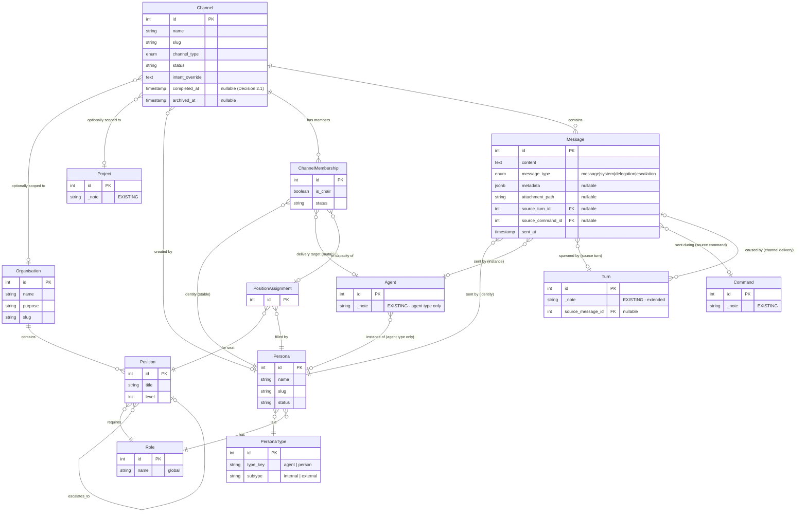

# Section 1: Channel Data Model

**Status:** Fully resolved (5 decisions)
**Workshop:** [Epic 9 — Inter-Agent Communication](../interagent-communication-workshop.md)
**Depends on:** [Section 0](section-0-infrastructure-audit.md)
**Canonical data model:** [`../erds/headspace-org-erd-full.md`](../erds/headspace-org-erd-full.md) — resolved outcomes are stored there. Embedded ERDs below are workshop working documents showing the design conversation at the time of resolution.

**Purpose:** Design the data model for channels, messages, and membership. This is the structural foundation — get the model right and the behaviour follows.

### UI/UX Context (from operator, 2 Mar 2026)

The primary interaction interface for channels is the **Voice Chat PWA** (`/voice`). Channels are cross-project — a channel can have members from different projects (e.g., Kent from economy, Robbo from headspace, Paula from org design). Key UI decisions:

- **Voice Chat PWA** is the primary participation interface. Channel API endpoints must be voice-chat-friendly (REST, token auth, voice-formatted responses — same patterns as existing voice bridge).
- **Dashboard card** for each active channel sits at the **top of the dashboard, above all project sections**. Shows: channel name, member list, last message summary/detail line.
- **Dashboard management tab** — new tab area for channel management (create, view, archive). Separate from the Kanban and existing views.
- **Kanban and other views evolve later** as the organisation builds out. Channel management is a new, separate surface.
- **Channels are NOT project-scoped by default.** A channel may optionally reference a project, but the common case is cross-project. This is more Slack (workspace-level channels) than GitHub (repo-scoped discussions).

---

### 1.1 Channel Model
- [x] **Decision: What is a Channel, and what does the table look like?**

**Depends on:** [Section 0](section-0-infrastructure-audit.md) (infrastructure audit must confirm feasibility)

**Context:** A channel is a conversation container. It needs to support:
- Group workshops (3+ participants, ongoing)
- Point-to-point delegation (2 participants, task-scoped)
- Org-wide announcements (broadcast)
- Possibly ephemeral channels (created for a task, archived on completion)

**Resolution:** Resolved 2 March 2026.

**Three new tables (Channel, ChannelMembership, Message) plus one new parent table (PersonaType).** The channel data model introduces a communication layer that sits above projects and optionally scopes to organisations. All participants — agents, operator, and future external collaborators — are unified under the Persona identity model via a type hierarchy.

#### PersonaType — New Parent Table

The operator's participation requirement ("I should be able to walk into any channel and start interacting") revealed that Persona needs a type hierarchy. A Persona is an identity — it can be an AI agent or a human person. The type determines delivery mechanism, trust boundaries, and visibility scope, not schema structure.

**PersonaType table (lookup, 4 rows):**

| Column | Type | Constraints | Purpose |
|--------|------|-------------|---------|
| `id` | `int` | PK | Standard integer PK |
| `type_key` | `String(16)` | NOT NULL | `agent` or `person` |
| `subtype` | `String(16)` | NOT NULL | `internal` or `external` |

**Unique constraint** on `(type_key, subtype)`. Four rows, no nulls, no ambiguity:

| id | type_key | subtype | Who |
|----|----------|---------|-----|
| 1 | agent | internal | Robbo, Con, Al, Paula, Gavin, Verner — run on operator's hardware |
| 2 | agent | external | Another system's agents — future cross-system collaboration |
| 3 | person | internal | Sam (operator) — physical access to hardware, god-mode dashboard |
| 4 | person | external | Client, prospect, collaborator — remote, scoped visibility |

**Persona gains `persona_type_id` FK** (NOT NULL) to PersonaType. Every Persona is in exactly one quadrant from creation.

**Behavioural differences by quadrant** (service-layer, not schema):

| Concern | Agent Internal | Agent External | Person Internal | Person External |
|---------|---------------|----------------|-----------------|-----------------|
| Delivery | tmux send-keys | API | SSE/dashboard/voice | Embed widget/API |
| Observation | Own channels | Own channels | All channels (god-mode) | Only joined channels |
| Skill injection | Yes | No | No | No |
| Handoff | Yes | No | No | No |
| Position in org | Via PositionAssignment | TBD | Above hierarchy | Outside hierarchy |
| Hardware access | Local machine | None | Local machine | None |
| Trust | Full | Dragons | Full | Scoped |

**Rationale:** The 2×2 matrix (agent/person × internal/external) was driven by the operator's insight that external collaborators (clients, prospects) should be able to join channels for co-design workshops alongside internal agents. The same structure also accommodates future inter-system agent communication (external agents). Both `type_key` and `subtype` are NOT NULL — no guessing which quadrant a Persona belongs to.

**Scope note:** v1 builds for internal agents and internal persons only. External agent and external person quadrants are modelled in the schema but not exercised. The pipes are in the slab; the dragon's bathroom is a future epic.

#### Channel Table

A channel is a named conversation container at the system level. Cross-project by default, optionally scoped to an Organisation and/or Project.

| Column | Type | Constraints | Purpose |
|--------|------|-------------|---------|
| `id` | `int` | PK | Standard integer PK |
| `name` | `String(128)` | NOT NULL | Human-readable name, e.g. "persona-alignment-workshop" |
| `slug` | `String(128)` | NOT NULL, UNIQUE | Auto-generated URL/CLI-safe identifier. Pattern: `{channel_type}-{name}-{id}` (consistent with Persona/Org slug patterns). Used in CLI: `flask channel send --channel workshop-persona-alignment-7` |
| `channel_type` | `Enum(ChannelType)` | NOT NULL | One of: `workshop`, `delegation`, `review`, `standup`, `broadcast`. Maps to Paula's intent templates (two-layer primer from [Decision 0.4](section-0-infrastructure-audit.md#04-channel-behavioral-primer)). |
| `description` | `Text` | NULLABLE | What this channel is for. Set at creation. Serves double duty as Slack's "topic" — no separate mutable topic field in v1. |
| `intent_override` | `Text` | NULLABLE | Custom 2-3 sentence intent that overrides the channel_type's default intent template. NULL means "use the type's default intent." Per Paula's two-layer primer architecture. |
| `organisation_id` | `int FK → organisations` | NULLABLE, ondelete SET NULL | Optional org scope. Most channels are cross-org (NULL). Org-scoped channels may enforce position-based membership validation in future. |
| `project_id` | `int FK → projects` | NULLABLE, ondelete SET NULL | Optional project scope. Most channels are cross-project (NULL). Economy planning channel references the economy project; persona workshop references nothing. |
| `created_by_persona_id` | `int FK → personas` | NULLABLE, ondelete SET NULL | Who created the channel. NULL = system-generated. Persona-based, not agent-based (stable identity). |
| `status` | `String(16)` | NOT NULL, default `"pending"` | 4-state lifecycle: `pending` (assembling members), `active` (first non-system message sent), `complete` (business concluded), `archived` (deep freeze). See [Decision 2.1](section-2-channel-operations.md#21-channel-lifecycle) for full lifecycle semantics. |
| `created_at` | `DateTime(timezone=True)` | NOT NULL | Standard UTC timestamp. |
| `completed_at` | `DateTime(timezone=True)` | NULLABLE | When the channel entered `complete` state. NULL = not yet complete. Set by `flask channel complete` or auto-complete (last active member leaves). Added by [Decision 2.1](section-2-channel-operations.md#21-channel-lifecycle). |
| `archived_at` | `DateTime(timezone=True)` | NULLABLE | When the channel was archived. NULL = not yet archived. |

**ChannelType enum:**

```python
class ChannelType(enum.Enum):
    WORKSHOP = "workshop"       # Resolved decisions with documented rationale
    DELEGATION = "delegation"   # Task completion to spec
    REVIEW = "review"           # Adversarial finding problems
    STANDUP = "standup"         # Status visibility and blocker surfacing
    BROADCAST = "broadcast"     # One-way from chair
```

**Slug auto-generation:** Same after_insert event mechanism as Persona and Organisation. Temp slug on insert, replaced with `{channel_type}-{name}-{id}` post-insert.

#### ChannelMembership Table

Membership is persona-based with explicit organisational capacity. The persona is the stable identity; the agent is the mutable delivery target. The position assignment records in what organisational capacity the persona participates.

| Column | Type | Constraints | Purpose |
|--------|------|-------------|---------|
| `id` | `int` | PK | Standard integer PK |
| `channel_id` | `int FK → channels` | NOT NULL, ondelete CASCADE | Which channel |
| `persona_id` | `int FK → personas` | NOT NULL, ondelete CASCADE | Who (stable identity — survives agent handoff) |
| `agent_id` | `int FK → agents` | NULLABLE, ondelete SET NULL | Current delivery target (mutable). Updated on handoff. NULL when persona has no active agent ("offline"). NULL for person-type personas (no Agent instance). |
| `position_assignment_id` | `int FK → position_assignments` | NULLABLE, ondelete SET NULL | In what organisational capacity. Set for org-scoped channels where the persona participates as a position holder. NULL for cross-org channels, the operator, or personas without positions. Enables future validation: position must belong to the channel's organisation. |
| `is_chair` | `bool` | NOT NULL, default `false` | Channel authority. Exactly one member per channel has `is_chair = true`. Chair capabilities: membership management, intent setting, channel closure. Delivery priority deferred to v2 ([Decision 0.4](section-0-infrastructure-audit.md#04-channel-behavioral-primer)). |
| `status` | `String(16)` | NOT NULL, default `"active"` | `active`, `left`, or `muted`. |
| `joined_at` | `DateTime(timezone=True)` | NOT NULL | When the persona joined the channel. |
| `left_at` | `DateTime(timezone=True)` | NULLABLE | When the persona left. NULL = still active. |

**Unique constraint** on `(channel_id, persona_id)` — a persona can only be in a channel once.

**Handoff continuity:** When HandoffExecutor creates a successor agent, it updates `agent_id` on all active channel memberships for that persona. The membership record persists; only the delivery target changes. From the channel's perspective, the persona never left.

#### Message Table

Full column design resolved in Decision 1.2. Shown here in full for completeness (canonical definition is in 1.2):

| Column | Type | Constraints | Purpose |
|--------|------|-------------|---------|
| `id` | `int` | PK | Standard integer PK |
| `channel_id` | `int FK → channels` | NOT NULL, ondelete CASCADE | Which channel |
| `persona_id` | `int FK → personas` | NOT NULL, ondelete SET NULL | Who sent it (stable identity) |
| `agent_id` | `int FK → agents` | NULLABLE, ondelete SET NULL | Which agent instance sent it (traceability). NULL for person-type personas. |
| `content` | `Text` | NOT NULL | Message content (markdown) |
| `message_type` | `Enum(MessageType)` | NOT NULL | Structural type: message, system, delegation, escalation (Decision 1.3) |
| `metadata` | `JSONB` | NULLABLE | Extensible structured data. Forward-compatible escape hatch. (Decision 1.2) |
| `attachment_path` | `String(1024)` | NULLABLE | Filesystem path to single uploaded file in `/uploads`. (Decision 1.2) |
| `source_turn_id` | `int FK → turns` | NULLABLE, ondelete SET NULL | The Turn that spawned this message (sender's outgoing turn). (Decision 1.2) |
| `source_command_id` | `int FK → commands` | NULLABLE, ondelete SET NULL | The Command the sender was working on. (Decision 1.2) |
| `sent_at` | `DateTime(timezone=True)` | NOT NULL | When the message was sent |

Messages are **immutable** — no edits, no deletes (Decision 1.2). See Decision 1.2 for full rationale, NULL cases, and bidirectional Turn/Command link design.

#### High-Level ERD (Workshop Working Document)

> **Note:** This is the workshop-time ERD showing the design conversation at the point of Decision 1.1. The canonical data model with all resolved decisions is in [`../erds/headspace-org-erd-full.md`](../erds/headspace-org-erd-full.md).



#### Design Decisions & Rationale

| Decision | Rationale |
|----------|-----------|
| **PersonaType as parent table** | The operator needs to participate in channels as a first-class identity. External collaborators (clients, prospects) need the same. A type hierarchy (agent/person × internal/external) unifies all participants under Persona without discriminator fields or special cases in the membership model. |
| **PersonaType.subtype NOT NULL** | Four quadrants, no ambiguity. Every Persona is classified at creation. No inference, no guessing "well if subtype is null it's probably internal." |
| **Cross-project, optionally org-scoped** | Operator's first use case spans projects and orgs. Channel sits at system level. Optional `organisation_id` and `project_id` FKs with SET NULL provide light scoping without enforcing it. |
| **Membership via PositionAssignment** | A persona can hold multiple positions across multiple orgs. Without the explicit FK, org-scoped channel membership requires inference across an ambiguous many-to-many. The explicit link answers "in what capacity" in one hop. |
| **No separate topic field** | Slack has description + topic. For agent channels, the chair states focus in a message. `description` covers the static purpose. Avoid field proliferation. |
| **Slug follows existing patterns** | `{channel_type}-{name}-{id}` consistent with Persona (`{role}-{name}-{id}`) and Organisation (`{purpose}-{name}-{id}`). Same after_insert mechanism. |
| **No reactivation from archived** | Archived means done. Create a new channel if needed. Revisiting old channels is a v2 concern. |
| **`created_by_persona_id` not agent_id** | Persona is the stable identity. If Robbo creates a channel and hands off, the channel was created by Robbo, not by agent #1103. |
| **Channel type as fixed enum** | Five types from Paula's guidance. New channel types are architectural decisions, not runtime configuration. Enum is cleaner than freeform string. |
| **External quadrants modelled but not exercised** | "Lay the pipes in the slab." The schema supports external agents and external persons without migration when that day comes. Service-layer trust/delivery/visibility concerns are deferred. |

#### Forward Context for Subsequent Decisions

- **1.2 (Message Model):** ✅ Resolved. 10-column table with metadata JSONB, single attachment_path, bidirectional Turn/Command links. Messages immutable. Turn model extended with source_message_id FK.
- **1.3 (Message Types):** ✅ Resolved. 4-type enum: message, system, delegation, escalation. Structural classification, not content/intent.
- **1.4 (Membership Model):** ✅ Resolved. Explicit join/leave for all, muted = delivery paused, one agent instance per active channel (partial unique index), no constraint on person-type.
- **1.5 (Relationship to Existing Models):** ✅ Resolved. Channel messages enter existing IntentDetector → CommandLifecycleManager pipeline. No special-case logic. No new Event types — Messages are their own audit trail. Channel scoping to Project and Organisation confirmed as structurally resolved by Decision 1.1 — no additional integration points needed.
- **[Section 5 (Migration Checklist)](section-5-migration-checklist.md):** New tables: `persona_types`, `channels`, `channel_memberships`, `messages`. New column: `personas.persona_type_id` (FK, NOT NULL — requires backfill migration for existing personas as `agent/internal`).

---

### 1.2 Message Model
- [x] **Decision: What is a Message, and what does the table look like?**

**Depends on:** 1.1

**Context:** A message belongs to a channel, from a sender. It's the atomic unit of communication. Messages may need to support different content types and carry metadata about their purpose.

**Resolution:**

Messages are the atomic unit of channel communication. They are **immutable** — no edits, no deletes. An agent conversation is an operational record; if Robbo told Con to build something and Con acted on it, you can't retroactively unsay it.

Messages are **bidirectionally linked to the existing Turn and Command models.** Agents interacting in channels still have their own Command/Turn history in the usual system. The channel Message ties these up at a higher level:

- **Outbound:** When Paula's agent produces a Turn that gets posted to a channel, the Message carries `source_turn_id` (which Turn spawned it) and `source_command_id` (which Command the sender was working on).
- **Inbound:** When a Message is delivered to Robbo's agent, the hook pipeline creates a Turn on Robbo's Command as normal. That Turn carries `source_message_id` (which Message caused it).

This gives full traceability: from a Message you can trace back to the sender's Turn and Command. From a Turn you can tell whether it came from a channel message or normal terminal input.

#### Message Table (Full)

| Column | Type | Constraints | Purpose |
|--------|------|-------------|---------|
| `id` | `int` | PK | Standard integer PK |
| `channel_id` | `int FK → channels` | NOT NULL, ondelete CASCADE | Which channel |
| `persona_id` | `int FK → personas` | NOT NULL, ondelete SET NULL | Sender identity (stable — survives agent handoff) |
| `agent_id` | `int FK → agents` | NULLABLE, ondelete SET NULL | Sender agent instance. NULL for person-type personas (operator, external persons). |
| `content` | `Text` | NOT NULL | Message content (markdown) |
| `message_type` | `Enum` | NOT NULL | Type of message (see Decision 1.3) |
| `metadata` | `JSONB` | NULLABLE | Extensible structured data. Forward-compatible escape hatch for future references (file context, tool output, structured payloads). When a pattern proves common, promote to a column. |
| `attachment_path` | `String(1024)` | NULLABLE | Filesystem path to single uploaded file in `/uploads`. One attachment per message for v1. Scoped to single attachment for MVP; column can be promoted to JSONB array for multiples in future without migration friction. |
| `source_turn_id` | `int FK → turns` | NULLABLE, ondelete SET NULL | The Turn that spawned this message (sender's outgoing turn). NULL for person-type personas and system messages. |
| `source_command_id` | `int FK → commands` | NULLABLE, ondelete SET NULL | The Command the sender was working on when they sent this message. Not redundant with source_turn_id — system messages about a Command have no source Turn but do relate to a Command. Saves a join for common queries. NULL for person-type personas. |
| `sent_at` | `DateTime(timezone=True)` | NOT NULL | When the message was sent |

**Modification to existing Turn model:**

| Column | Type | Constraints | Purpose |
|--------|------|-------------|---------|
| `source_message_id` | `int FK → messages` | NULLABLE, ondelete SET NULL | If this Turn was created by delivery of a channel Message. NULL for Turns from normal terminal input. Enables tracing a Turn back to the channel message that caused it. |

#### What's deliberately absent

| Omission | Rationale |
|----------|-----------|
| `edited_at` / `deleted_at` | Messages are immutable. Simpler, correct, consistent with Event audit trail philosophy. |
| `parent_message_id` (threading) | Channels are already scoped conversations. Agent conversations tend to be sequential. V2 concern. |
| Per-recipient delivery tracking | Fire-and-forget in v1. If needed later, it's a separate `MessageDelivery` table, not columns on Message. |

#### NULL cases

| Scenario | source_turn_id | source_command_id | agent_id |
|----------|----------------|-------------------|----------|
| Agent sends message | Set (sender's Turn) | Set (sender's Command) | Set (sender's agent instance) |
| Operator sends message | NULL (no Agent) | NULL (no Command) | NULL (person-type) |
| System message ("Sam joined") | NULL | NULL (unless about a Command) | NULL |

---

### 1.3 Message Types
- [x] **Decision: What types of messages exist, and do they have different semantics?**

**Depends on:** 1.2

**Resolution:**

Message type is a **structural** classification, not a content/intent classification. It answers "what kind of thing is this?" not "what is the sender trying to say?" Content intent (question, answer, report) is a service-layer concern handled by intent detection, same as TurnIntent works today for Turns.

#### MessageType Enum

| Type | Purpose | Who sends it |
|------|---------|-------------|
| `message` | Standard persona-to-channel communication. The default type. | Any persona (agent or person) |
| `system` | System-generated events. Membership changes ("Sam joined the channel"), channel state changes ("Channel archived"), automated notifications. | System (no sender persona in practice, though persona_id is NOT NULL — use a system persona or the channel creator) |
| `delegation` | Task assignment. Chair assigns work to a member. Structurally identical to `message` but semantically distinct — delivery and UI may treat it differently (e.g., highlight, require acknowledgement). | Typically the chair, but any member can delegate. |
| `escalation` | Flagging something up the organisational hierarchy. Signals that the content needs attention from someone with more authority or a different domain. | Any member |

**What's NOT a message type:** `question`, `answer`, `report`, `command`, `progress` — these are content semantics detectable by the intelligence layer. A `message` that asks a question is still type `message`. A `delegation` that asks a question is still type `delegation`. Intent detection is orthogonal to message type.

**Delivery behaviour:** In v1, all types are delivered identically. Type-specific delivery behaviour (e.g., escalation triggers membership changes, delegation requires acknowledgement) is deferred to [Section 3](section-3-message-delivery.md) and beyond.

---

### 1.4 Membership Model
- [x] **Decision: What are the remaining membership semantics beyond the structural design in 1.1?**

**Depends on:** 1.1

**Context:** The ChannelMembership table was structurally resolved in 1.1 (columns, constraints, handoff continuity). Three remaining questions: operator participation model, mute semantics, and agent-channel concurrency.

**Resolution:**

#### Explicit join/leave for all persona types

All personas — agent-type and person-type — use explicit join and leave actions. No god-mode auto-membership. The operator joins a channel to participate, leaves when done. Same flow as any agent persona. This keeps the model uniform and works cleanly for both internal and external persona types.

#### Mute semantics

Muted = **delivery paused**. The member remains in the channel. Messages continue to accumulate in the channel (they're channel records, not per-recipient). When unmuted, the member can catch up via channel history. Delivery resumes from that point forward. Mute is a member-side delivery control, not a channel-side content filter.

#### One agent instance, one active channel

**Constraint: an agent_id can only appear on ONE active ChannelMembership at a time.** Enforced via partial unique index in PostgreSQL:

```sql
CREATE UNIQUE INDEX uq_active_agent_one_channel
ON channel_memberships (agent_id)
WHERE status = 'active' AND agent_id IS NOT NULL;
```

**Rationale:** A single agent instance in multiple channels simultaneously will get context-confused — channel messages from different conversations interleave in its terminal, and the agent has no way to disambiguate which channel it's responding to. One agent, one channel prevents context pollution.

**This constraint applies to agent-type personas only.** Person-type personas (the operator, external collaborators) can hold active membership in multiple channels simultaneously. Humans can context-switch between conversations; agents can't.

**Multiple agents for the same persona is fine.** Con (the persona) can have agent #1053 in channel A and agent #1054 in channel B. The persona is in multiple channels; each agent instance is in exactly one. This models reality — Con is software, you can run multiple instances.

#### Forward context for 1.5

The one-agent-one-channel constraint has implications for how channel messages create Commands and Turns on receiving agents (Decision 1.5). Because an agent is in exactly one channel, there's no ambiguity about which channel an agent's output relates to — it's always the one channel they're a member of.

---

### 1.5 Relationship to Existing Models
- [x] **Decision: How do channels and messages integrate with existing Headspace models?**

**Depends on:** 1.1, 1.2, 1.4

**Context:** Channels don't exist in isolation — they interact with Agents, Commands, Turns, Projects, and potentially Organisations. The integration points need to be clean.

**Resolution:**

#### Channel messages enter the existing pipeline — no special-case logic

When a channel message is delivered to an agent (via tmux or other delivery mechanism), it enters the **same processing pipeline as any other input.** The IntentDetector classifies the content, and the CommandLifecycleManager handles state transitions accordingly.

- **IntentDetector decides.** The delivered message content is processed by the IntentDetector, which determines the intent (COMMAND, ANSWER, QUESTION, etc.). If the detector classifies it as COMMAND intent, the CommandLifecycleManager creates a new Command. If it classifies as ANSWER, PROGRESS, or other intent, it becomes a Turn on the agent's current Command.
- **`delegation` message type biases but doesn't override.** A `delegation` message type is a hint that biases the IntentDetector toward COMMAND intent, but the detector still makes the final classification. Same pipeline, same rules — channel messages just enter through a different door.
- **The Turn created by delivery carries `source_message_id`** (resolved in 1.2), linking it back to the channel Message that caused it. This is the only channel-specific addition to the pipeline.

#### No new Event types

Messages are their own audit trail. The Message table captures: who said what, in which channel, when, linked to which Turn and Command via bidirectional FKs. Writing a `MESSAGE_SENT` Event for every Message would duplicate data into a second table for no reason.

The existing Event pipeline continues to fire for state transitions, hook events, and session lifecycle — the things it already tracks. Channel messages have their own table and their own query surface.

#### Channel scoping — already resolved

Channel scoping to Project (`project_id` FK, nullable) and Organisation (`organisation_id` FK, nullable) was resolved structurally in Decision 1.1. No additional integration points are needed. Channels are cross-project by default; optional FKs provide light scoping without enforcement.

#### Summary

| Question | Answer |
|----------|--------|
| Does a received message create a Turn? | Yes — through the normal pipeline. IntentDetector classifies, CommandLifecycleManager acts. |
| Does a delegation message create a Command? | Only if the IntentDetector classifies the content as COMMAND intent. The `delegation` type biases but doesn't override. |
| Do Messages generate Events? | No. Messages are their own audit trail. No duplication. |
| Channel scoping? | Resolved in 1.1. Nullable FKs to Project and Organisation. |
